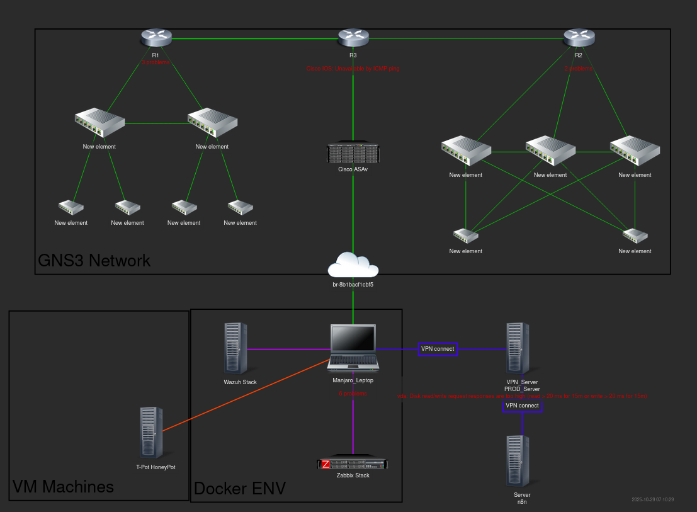
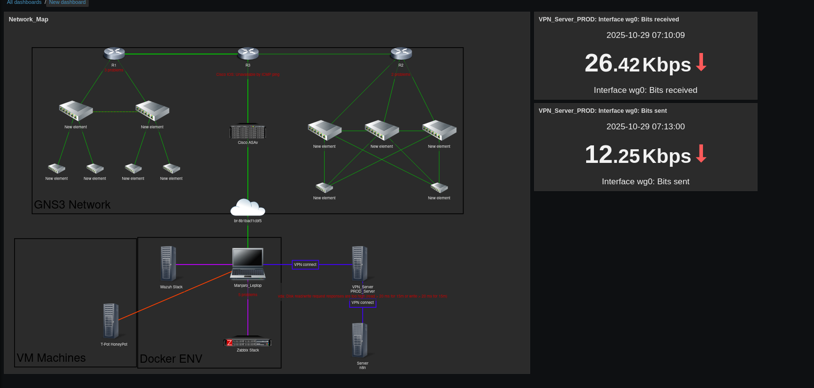

# Zabbix dashboard and alert
Pentru teste am pus un serviciul `zabbix` local prin **docker compose**.
### Adaugarea mapei de retea:
Voi elaboratea reteau mea care este formata din (VPN-Server(docker-compose wireguar), Prod-server, Server de asistentul N8N, Hostul cu Wazuh, Zabbix, Traefik ...) acestea trebuie sa fie adaugate in Zabbix ca host.

Adaugarea hosturilor in zabbix se face prin zabbix-agent


### Check the zabbix agent:
```bash
zabbix_get -s 172.19.0.1 -p 10050 -k agent.ping
```
Config file for agent:
```bash
/etc/zabbix/zabbix_agentd.conf
```
### Adaugarea hosturilor in Zabbix
Adaugam serverul de VPN in zabbix pentru monitorizarea ulterioara cu hosturile enumerate mai sus procedura e simulara de mentionat in acest caz o sa adaug doar hosturi/server deci vor fii adauga prin agent:

### Creiem carta retelei:
Acum trecem la crearea retelei de pentru infrastructura creata


### Adaugarea unui dashboard customezat 

#TODO Arata uboga Acum arata tot uboga 
#TODO adaug mai multe dispozitive fac un dashboard pentru toate 