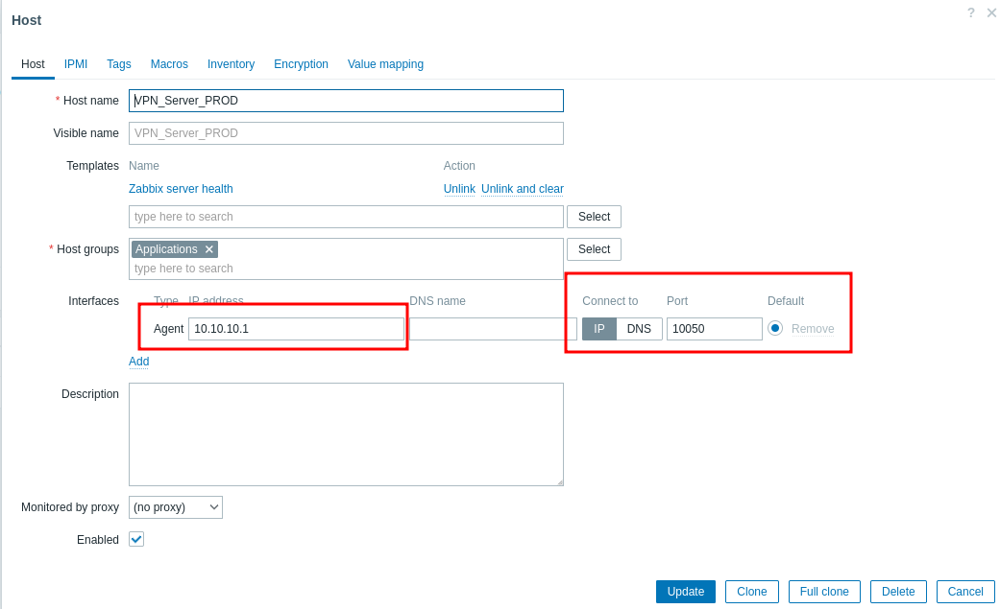
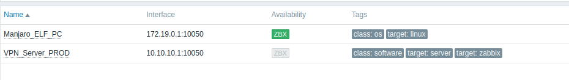
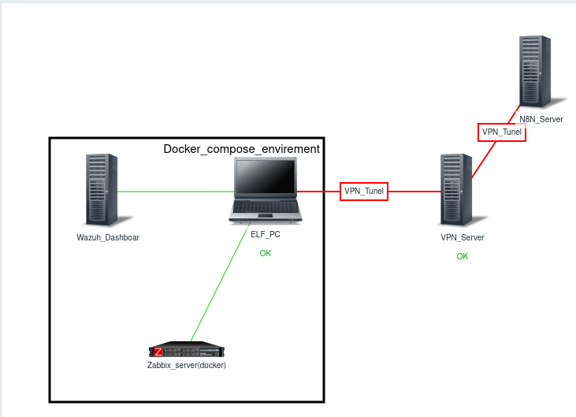
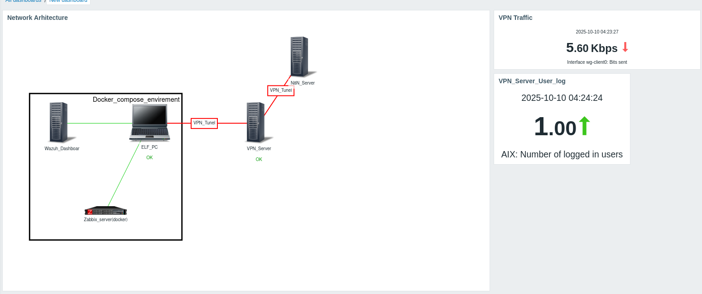

# Zabbix dashboard and alert
Pentru teste am pus un serviciul `zabbix` local prin **docker compose**.
### Adaugarea mapei de retea:
Voi elaboratea reteau mea care este formata din (VPN-Server(docker-compose wireguar), Prod-server, Server de asistentul N8N, Hostul cu Wazuh, Zabbix, Traefik ...) acestea trebuie sa fie adaugate in Zabbix ca host.

Adaugarea hosturilor in zabbix se face prin zabbix-agent

### Adaugarea hosturilor in Zabbix
Adaugam serverul de VPN in zabbix pentru monitorizarea ulterioara cu hosturile enumerate mai sus procedura e simulara de mentionat in acest caz o sa adaug doar hosturi/server deci vor fii adauga prin agent:

La momentul dat avem 2 hosturi :(

#TODO add more hosts 
### Creiem carta retelei:
Acum trecem la crearea retelei de pentru infrastructura creata

Date 10.10.25
Greu de numit asta harta la retea :(
#TODO extinderea retelei adaugarea routelor prin (SNMP)

### Adaugarea unui dashboard customezat 

#TODO Arata uboga