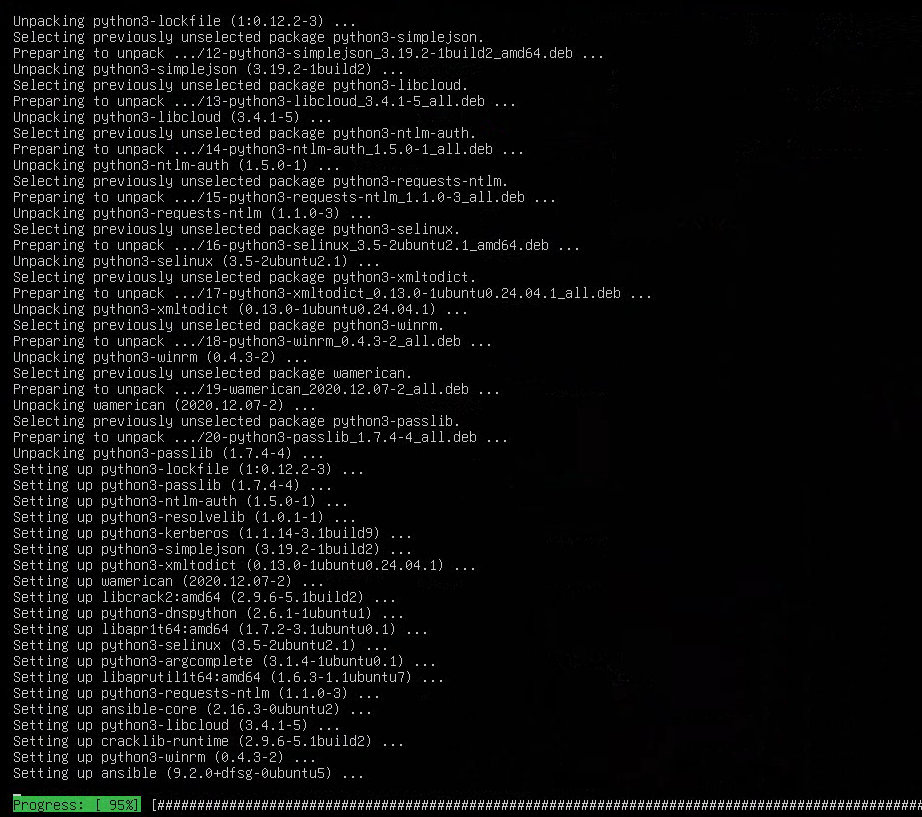
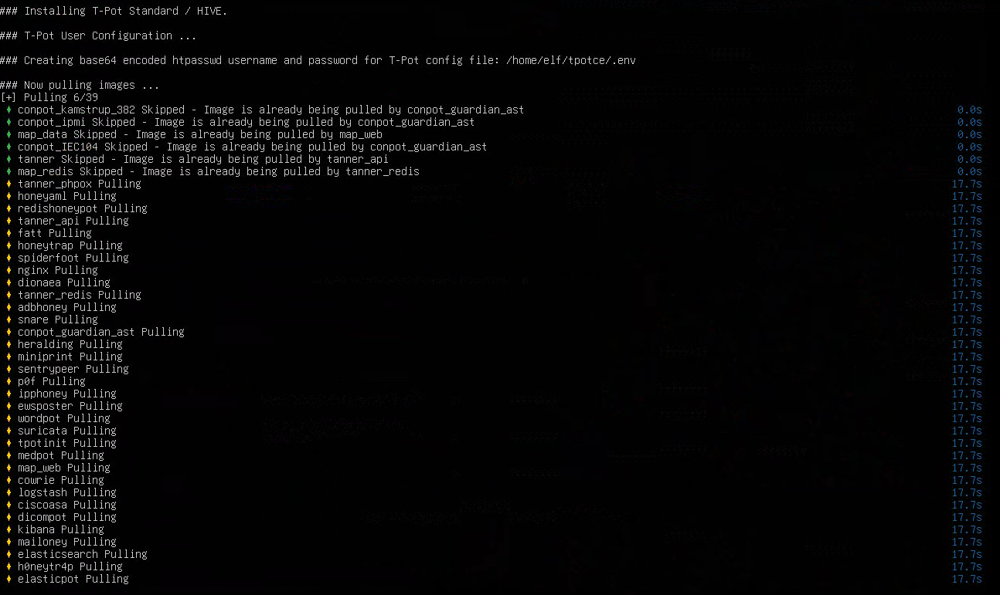

# Resurse necesare:

    CPU: 4 core
    RAM: 8 GB
    Disk: 250 GB SSD
    Network: 1 Gbps (ideal), merge și 100 Mbps
    OS: Ubuntu 22.04 LTS (fără GUI)

## Resurse aplicabile 

    CPU: 4 core
    RAM: 5 GB
    Disk: 100 GB
    Network: 1 Gbps
    OS: Ubuntu 22.04 LTS (fără GUI)
https://www.bokehsolutions.com/component/content/article/t-pot-honeynet-how-to-set-up-and-monitor-your-own-network-of-decoys.html?catid=12&Itemid=101

## Install T-Pot:
Pregatim serverul cu updaturile si instalam packetele necesare:
```bash
sudo apt update && sudo apt upgrade -y
sudo apt install -y git curl wget unzip ca-certificates apt-transport-https software-properties-common
sudo apt install -y util-linux
```
Clonam si pregatim scriptul pentru instalarea mai departa:
```bash
cd /opt
sudo git clone https://github.com/telekom-security/tpotce.git
cd tpotce/iso/installer
sudo ./install.sh --type user
```
Instalarea se executa in felul dat:
```bash
./install.sh -t h -u <user> -p <pass> #pentru interfata grafica
```


Dupa ce sistemul se adapteza acesta o sa intaleze docker-containerile care si sunt HonePoturile noastre 



Dupa instalare accesul se face la adresa web data `https://<IP>:64297/` si logarea se face la fel aici.

Dupa o perioada putem observa 


[Documentatia este aici](https://github.security.telekom.com/2024/04/honeypot-tpot-24.04-released.html)