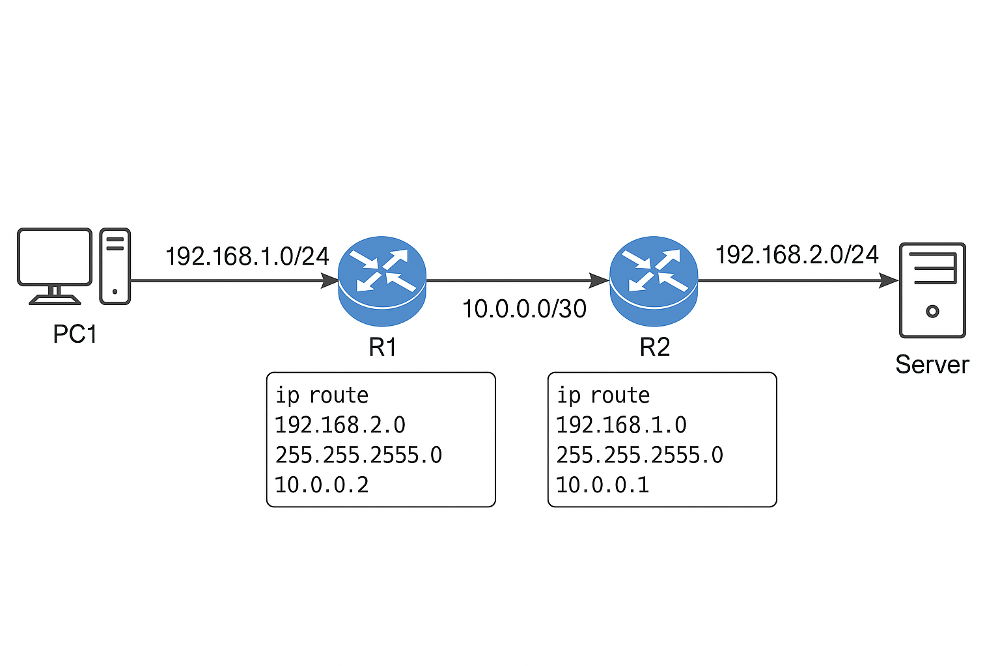

#  Routarea Statică

Rutarea statică este cel mai simplu mod de a direcționa traficul într-o rețea.  
Administratorul configurează manual rutele pe fiecare echipament, specificând destinația, masca și gateway-ul de ieșire.

---

##  Concept de bază
- Rutele sunt **fixe** și nu se schimbă automat.
- Se configurează manual de către administrator.
- Ideală pentru **rețele mici** sau **legături către destinații stabile** (ex: conexiune către un server sau o rută default).

---

##  Exemplu de topologie simplă

```
[PC1 192.168.1.10] --- [R1] --- [R2] --- [Server 192.168.2.20]
                         |        |
                     10.0.0.1   10.0.0.2
```


R1 trebuie să știe cum ajunge la rețeaua `192.168.2.0/24`,  
iar R2 trebuie să știe cum ajunge la `192.168.1.0/24`.

---

## Configurație Cisco

```cisco
R1> enable
R1# configure terminal
R1(config)# ip route <DESTINATIE> <MASK> <NEXT_HOP>
```

Exemplu concret:
```cisco
R1(config)# ip route 192.168.2.0 255.255.255.0 10.0.0.2
R2(config)# ip route 192.168.1.0 255.255.255.0 10.0.0.1
```

 **Explicație:**  
Routerul R1 va trimite traficul către rețeaua `192.168.2.0/24` prin gateway-ul `10.0.0.2`.

Pentru a verifica rutele adăugate:
```cisco
show ip route
```

---

##  Configurație Linux

Adăugăm o rută statică:
```bash
sudo ip route add <DESTINATIE>/<MASK> via <GATEWAY>
```

Exemplu concret:
```bash
sudo ip route add 192.168.2.0/24 via 10.0.0.2
```

Aceasta este o rută **temporară** — se pierde la restart.  
Pentru persistență, adaug-o în fișierul de configurare al interfeței (`/etc/netplan/` sau `/etc/network/interfaces`).

Verificarea rutelor existente:
```bash
ip route show
```

---

##  Rutele Agregate (Summary Routes)

Rutele agregate combină mai multe rețele mici într-una mai mare, reducând dimensiunea tabelei de rutare.

Exemplu:
```cisco
192.168.0.0/24
192.168.1.0/24
192.168.2.0/24
192.168.3.0/24
```

Toate acestea pot fi agregate ca:
```
192.168.0.0/22
```
 `/22` acoperă toate adresele de la `192.168.0.0` până la `192.168.3.255`.

---

##  Verificare și depanare

| Comandă | Descriere |
|----------|------------|
| `show ip route` | Afișează tabela de rutare (Cisco) |
| `traceroute <IP>` | Urmărește traseul pachetelor |
| `ping <IP>` | Verifică conectivitatea de bază |
| `debug ip routing` | Arată modificările tabelei de rutare |

---

##  Avantaje
- Simplu de configurat și înțeles  
- Stabil (nu depinde de protocoale dinamice)  
- Ideal pentru medii izolate sau statice

##  Dezavantaje
- Necesită întreținere manuală  
- Nu se adaptează automat la schimbări de topologie  
- Devine dificil de administrat în rețele mari

---

##  Resurse recomandate
- [Cisco – Static Routing Guide]()
- [Linux ip-route manual]()

---
