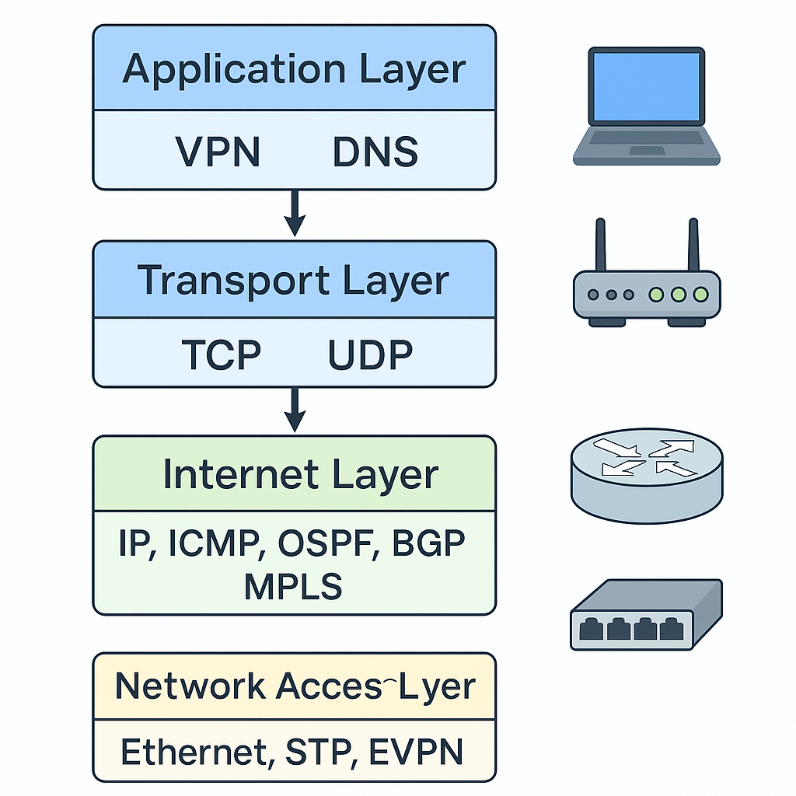

# Stack of Protocols

Această colecție de note documentează protocoalele fundamentale folosite în rețelele moderne — de la rutare statică și dinamică până la VPN, MPLS și EVPN multihoming.

##  Conținut
1. [Statical Routing](0.StaticalRouting/README.md)
2. [Spanning Tree Protocol (STP)](1.STP/README.md)
3. [ACL și NAT](2.ACL_and_NAT/README.md)
4. [Dynamical Routing](3.DynamicalRouting/README.md)
5. [VPN](4.VPN/README.md)
6. [Multicast](5.Multicast/README.md)
7. [MPLS](6.MPLS/README.md)
8. [EVPN Multihoming](7.EVPN_Multihoming/README.md)

## Structură
Fiecare subdirector conține:
- Fișier `README.md` propriu cu explicații teoretice.  
- Exemple de configurații (Cisco/Linux).  
- Diagrame explicative în format `.png` / `.drawio`.  
- Linkuri către materiale de laborator și documentație oficială.

## Laboratoare practice
| Tema | Descriere | Locație |
|------|------------|---------|
| Lab 1 | Configurare rutare statică între 3 routere | [0.StaticalRouting/lab1.md](0.StaticalRouting/lab1.md) |
| Lab 2 | Rutare dinamică OSPF între domenii | [3.DynamicalRouting/lab2.md](3.DynamicalRouting/lab2.md) |
| Lab 3 | Creare tunel VPN site-to-site | [4.VPN/lab3.md](4.VPN/lab3.md) |

