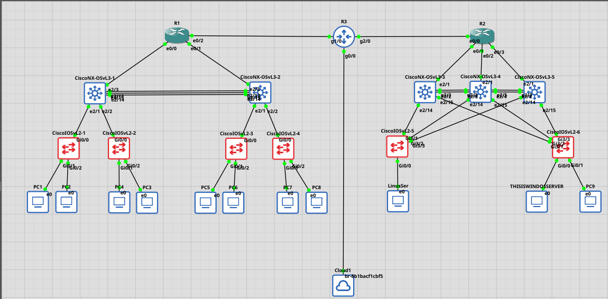

#TODO

```bash
            ┌──────────────┐
            │     Core     │ ← R3
            └──────┬───────┘
            /       \
    ┌───────┴───────┐  ┌────────┴────────┐
    │ Distribution  │  │  Distribution   │ ← NX-OSvL3-1..5
    └───────┬───────┘  └────────┬────────┘
        Access (L2)         Access (L2)
    ┌─────┴─────┐           ┌────┴────┐
    PC1..PC8, Servers      Linux/Windows
```

