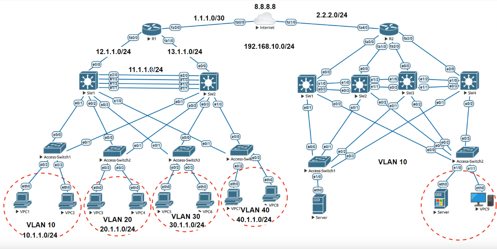
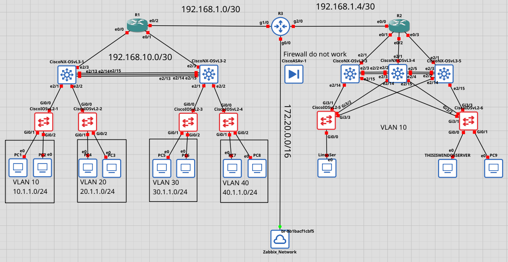

#TODO





```bash
            ┌──────────────┐
            │     Core     │ ← R3
            └──────┬───────┘
            /       \
    ┌───────┴───────┐  ┌────────┴────────┐
    │ Distribution  │  │  Distribution   │ ← NX-OSvL3-1..5
    └───────┬───────┘  └────────┬────────┘
        Access (L2)         Access (L2)
    ┌─────┴─────┐           ┌────┴────┐
    PC1..PC8, Servers      Linux/Windows
```

## Activam SNMP pe routere:
```bash
snmp-server community public RO
snmp-server location "R1 edge"
snmp-server contact "stas@i9t24.online"
```


```bash
sudo ip route add 192.168.1.0/30 via 172.20.0.100
sudo ip route add 192.168.1.4/30 via 172.20.0.100   # dacă ai link R3–R2
```

```bash
#Instand for wr mem:
copy running-config startup-config
```

| Legătură     | Rețea           | Dispozitive            | IP-uri                      |
| ------------ | --------------- | ---------------------- | --------------------------- |
| R1 ↔ L3-1    | 192.168.10.0/30 | R1–L3-1                | 192.168.10.1 / 192.168.10.2 |
| R1 ↔ L3-2    | 192.168.1.0/30  | R1–L3-2                | 192.168.1.1 / 192.168.1.2   |
| R1 ↔ R3      | 192.168.1.4/30  | R1–R3                  | 192.168.1.5 / 192.168.1.6   |
| R3 ↔ R2      | 192.168.1.8/30  | R3–R2                  | 192.168.1.9 / 192.168.1.10  |
| VLAN 10      | 10.1.1.0/24     | PC1, PC2               | GW: 10.1.1.1                |
| VLAN 20      | 20.1.1.0/24     | PC3, PC4               | GW: 20.1.1.1                |
| VLAN 30      | 30.1.1.0/24     | PC5, PC6               | GW: 30.1.1.1                |
| VLAN 40      | 40.1.1.0/24     | PC7, PC8               | GW: 40.1.1.1                |
| VLAN Servere | 172.20.0.0/16   | Linux, Windows, Zabbix | GW: 172.20.0.1              |

| Dispozitiv                  | Interfață     | Adresă IP / Masca   | Rețea           | Conectat la           | Descriere                           |
| --------------------------- | ------------- | ------------------- | --------------- | --------------------- | ----------------------------------- |
| **R1 (Router utilizatori)** | e0/0          | 192.168.10.1 /30    | 192.168.10.0/30 | CiscoNX-OSvL3-1       | Legătură uplink VLAN-uri stânga     |
|                             | e0/2          | 192.168.1.1 /30     | 192.168.1.0/30  | R3 g1/0               | Legătură OSPF spre R3               |
|                             | —             | —                   | —               | —                     | Alte porturi neutilizate            |
| **R3 (Router tranzit)**     | g1/0          | 192.168.1.2 /30     | 192.168.1.0/30  | R1 e0/2               | Link spre R1                        |
|                             | g2/0          | 192.168.1.5 /30     | 192.168.1.4/30  | R2 e0/0               | Link spre R2                        |
|                             | g0/0          | 172.20.0.100 /16    | 172.20.0.0/16   | Cloud/Zabbix          | Conectare management                |
| **R2 (Router servere)**     | e0/0          | 192.168.1.6 /30     | 192.168.1.4/30  | R3 g2/0               | Legătură spre R3                    |
|                             | e0/1          | —                   | —               | NX-OS L3-4            | Legătură VLAN 10 servere            |
|                             | e0/2, e0/3    | —                   | —               | NX-OS L3-5            | Legături redundante                 |
| **CiscoNX-OSvL3-1**         | e2/3          | 192.168.10.2 /30    | 192.168.10.0/30 | R1 e0/0               | Uplink spre R1                      |
|                             | VLAN 10 (SVI) | 10.1.1.1 /24        | 10.1.1.0/24     | L2-1, PC1–PC2         | Gateway VLAN 10                     |
|                             | VLAN 20 (SVI) | 20.1.1.1 /24        | 20.1.1.0/24     | L2-2, PC3–PC4         | Gateway VLAN 20                     |
| **CiscoNX-OSvL3-2**         | e2/3          | 192.168.10.6 /30    | 192.168.10.4/30 | R1 (backup uplink)    | Link secundar / redundanță          |
|                             | VLAN 30 (SVI) | 30.1.1.1 /24        | 30.1.1.0/24     | L2-3, PC5–PC6         | Gateway VLAN 30                     |
|                             | VLAN 40 (SVI) | 40.1.1.1 /24        | 40.1.1.0/24     | L2-4, PC7–PC8         | Gateway VLAN 40                     |
| **CiscoNX-OSvL3-4**         | e2/1          | 192.168.1.10 /30    | 192.168.1.8/30  | R2 e0/1               | Uplink spre router R2               |
|                             | VLAN 10 (SVI) | 172.20.0.1 /16      | 172.20.0.0/16   | L2-5, LinuxSer        | Gateway servere                     |
| **CiscoNX-OSvL3-5**         | e2/1          | 192.168.1.14 /30    | 192.168.1.12/30 | R2 e0/2               | Redundanță către R2                 |
|                             | VLAN 10 (SVI) | 172.20.0.2 /16      | 172.20.0.0/16   | L2-6, WindowsSrv, PC9 | Gateway servere secundar            |
| **Linux Server**            | e0            | 172.20.0.10 /16     | 172.20.0.0/16   | L2-5                  | Server management                   |
| **Windows Server**          | e0            | 172.20.0.20 /16     | 172.20.0.0/16   | L2-6                  | Server aplicații                    |
| **PC1**                     | e0            | 10.1.1.10 /24       | 10.1.1.0/24     | VLAN 10               | Client VLAN 10                      |
| **PC2**                     | e0            | 10.1.1.11 /24       | 10.1.1.0/24     | VLAN 10               | Client VLAN 10                      |
| **PC3**                     | e0            | 20.1.1.10 /24       | 20.1.1.0/24     | VLAN 20               | Client VLAN 20                      |
| **PC4**                     | e0            | 20.1.1.11 /24       | 20.1.1.0/24     | VLAN 20               | Client VLAN 20                      |
| **PC5**                     | e0            | 30.1.1.10 /24       | 30.1.1.0/24     | VLAN 30               | Client VLAN 30                      |
| **PC6**                     | e0            | 30.1.1.11 /24       | 30.1.1.0/24     | VLAN 30               | Client VLAN 30                      |
| **PC7**                     | e0            | 40.1.1.10 /24       | 40.1.1.0/24     | VLAN 40               | Client VLAN 40                      |
| **PC8**                     | e0            | 40.1.1.11 /24       | 40.1.1.0/24     | VLAN 40               | Client VLAN 40                      |
| **PC9**                     | e0            | 172.20.0.30 /16     | 172.20.0.0/16   | VLAN 10 (dreapta)     | Client servere                      |
| **Cloud1 (Zabbix)**         | br-8b1bacf1cbf    | 172.20.0.6 | 172.20.0.0/16   | VLAN 10 (dreapta)     | Conectare cloud/Zabbix monitorizare |
