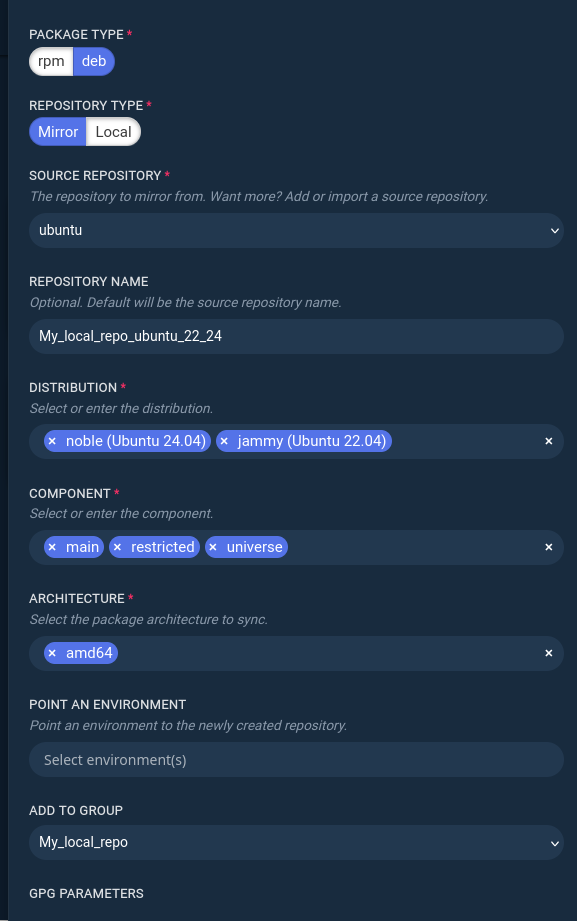
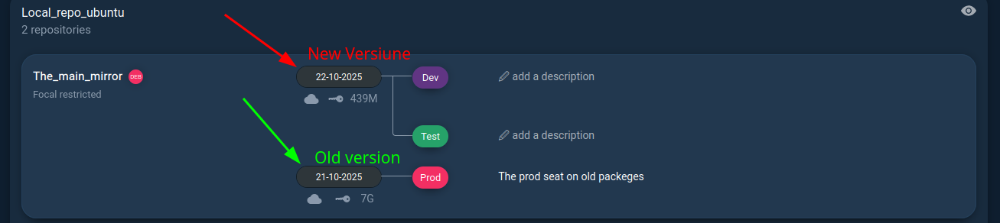

# Adaugarea unui mirror complet:
In cazul meu am adaugat repo `ubuntu` cu pachetele `main`,`restricted`,`universe` pentru arhitectura `amd64` nu adaugam nici un envirement dar trebuie sal adaugam in groupul nostru:



Pachetele schimbate in snapshotul nou  de la data de (22-10-2025):
```bash
nvidia-graphics-drivers-435/libnvidia-gl-435_435.21-0ubuntu7_amd64.deb
libnvidia-fbc1-440_440.82+really.440.64-0ubuntu6_amd64.deb
libnvidia-compute-440_440.82+really.440.64-0ubuntu6_amd64.deb
...
```

Aici sunt volumele:
```bash
ls -la /var/lib/docker/volumes/repomanager_repomanager-repo/_data 
```

Avem urmatoarea logica:

Aici 439Mb sunt ocupata de pachetele noi 


Pe serverul de test avem urmatoarele surse:
```bash
apt update
Ign:1 http://172.22.0.5:8080/repo/deb/The_main_mirror/focal/restricted/Test focal InRelease
Get:2 http://172.22.0.5:8080/repo/deb/The_main_mirror/focal/restricted/Test focal Release [3346 B]
Get:3 http://172.22.0.5:8080/repo/deb/The_main_mirror/focal/restricted/Test focal Release.gpg [874 B]
Get:4 http://172.22.0.5:8080/repo/deb/The_main_mirror/focal/restricted/Test focal/restricted amd64 Packages [45.8 kB]
Fetched 50.0 kB in 0s (320 kB/s)     
```

Prod repo:
```bash
apt update
Ign:1 http://172.22.0.5:8080/repo/deb/The_main_mirror/focal/restricted/Prod focal InRelease
Hit:2 http://172.22.0.5:8080/repo/deb/The_main_mirror/focal/restricted/Prod focal Release
```

Problema depistata este ca nu avem sursa la mirrorul principal deci nu o sa putem adauga pachete noi :(

| Variantă             | URL sursă                               | Când se folosește                                                      | Recomandare                                                      |
| -------------------- | --------------------------------------- | ---------------------------------------------------------------------- | ---------------------------------------------------------------- |
| **`ubuntu`**         | `http://archive.ubuntu.com/ubuntu`      | pentru majoritatea sistemelor curente (Desktop/Server standard)        | ✅ *Alege aceasta*                                                |
| **`ubuntu-archive`** | `http://old-releases.ubuntu.com/ubuntu` | pentru versiuni **vechi (EOL)** care nu mai sunt pe archive.ubuntu.com | ❌ doar dacă faci mirror pentru versiuni vechi (ex: 16.04, 18.04) |


| Componentă     | Ce conține                                                                | Recomandare     | Dimensiune estimată |
| -------------- | ------------------------------------------------------------------------- | --------------- | ------------------- |
| **main**       | Pachete oficiale suportate de Canonical (kernel, apt, systemd, bash etc.) | ✅ *obligatoriu* | ~5–6 GB             |
| **restricted** | Drivere cu licență restrânsă (ex. NVIDIA, firmware-uri)                   | ✅ *recomandat*  | ~2 GB               |
| **universe**   | Pachete open-source întreținute de comunitate                             | ✅ *recomandat*  | ~20–25 GB           |
| **multiverse** | Pachete cu restricții de licență (codecuri, multimedia, etc.)             | ⚙️ *opțional*   | ~5–8 GB             |


## Combinatie recomandată (completă):
```yml
main restricted universe multiverse
```
Dacă vrem mirror mai mic (doar pachetele esențiale pentru servere):
```yml
main restricted
```

## Acum sa facem un mirror complet:
```bash
main restricted
# Pentru sistemele date:
Ubuntu 22
Ubuntu 24 
```


# Install linupdate:
Adaugarea `key` si repoul pentru `linupdate`:
```bash
curl -sS https://packages.repomanager.net/repo/gpgkeys/packages.repomanager.net.pub | gpg --dearmor > /etc/apt/trusted.gpg.d/packages.repomanager.net.gpg
echo "deb https://packages.repomanager.net/repo/deb/linupdate3/noble/main/prod noble main" > /etc/apt/sources.list.d/linupdate.list
apt update && apt install linupdate
```
Conectarea agentul cu RepoManager server:
```bash
linupdate --mod-configure reposerver --url http://172.22.0.5:8080 --agent-listen-enable true
linupdate --mod-configure reposerver --register --api-key ak_OL5d8fR1V3JtYQAz2WXalk74oFM0iKqD
```
Rularea:
```bash
linupdate --mod-configure reposerver --agent-enable true
```

