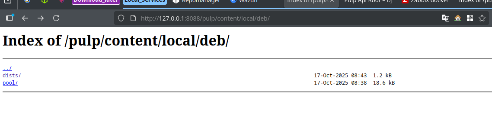

# Instalarea și Configurare Pulp (Debian Repository)
## Desfășurarea Pulp cu Docker Compose:
Fișierul docker-compose.yml definește serviciile necesare: containerul principal Pulp și un container de interfață grafică (pulp-ui).
```yml 
services:
  pulp:
    image: pulp/pulp:stable
    container_name: pulp
    ports:
      - "8088:80"        # API Pulp accesibil la http://localhost:8088
    volumes:
      - ./settings:/etc/pulp
      - ./pulp_storage:/var/lib/pulp
      - ./pgsql:/var/lib/pgsql
      - ./containers:/var/lib/containers
    environment:
      PULP_WORKERS: "4"
      PULP_API_WORKERS: "2"
      PULP_CONTENT_WORKERS: "2"
    restart: unless-stopped

  pulp-ui:
    image: node:22-bullseye
    container_name: pulp-ui
    working_dir: /app
    # instalăm git, marcăm /app ca safe, apoi pornim UI-ul
    command: bash -lc "apt-get update && apt-get install -y git && git config --global --add safe.directory /app && npm install && npm run start"
    ports:
      - "3333:8002"            # UI: http://localhost:3333
    volumes:
      - ./pulp-ui:/app         
    environment:
      - CI=true
    depends_on:
      - pulp
```
Pornirea Serviciilor:
```bash
docker-compose up -d
```
- Pulp API va fi accesibil la http://localhost:8088.
- Pulp UI (interfața grafică) va fi accesibilă la http://localhost:3333.
## Instalarea CLI:
Instalați CLI-ul de bază și plugin-ul pentru pachete Debian
```bash
python3 -m pip install --user pulp-cli pulp-cli-deb
```

## Configurarea Profilului CLI:
Se creează un profil de configurare, specificând URL-ul și credențialele. Notă: În Docker, containerul pulp are adresa IP 172.22.0.2 (sau similar) în rețeaua Docker internă.
```bash
~/.local/bin/pulp config create \
  --base-url http://172.22.0.2 \
  --username admin \
  --password 'password'
```
## Crearea Depozitului Debian (Repository)
```bash
pulp deb repository create --name local-deb
```
Încărcarea Pachetelor (Pulp CLI)
```bash
## Încărcare Artefact (pachetul brut):
pulp artifact upload --file /tmp/debs/cowsay_3.03+dfsg2-8_all.deb
```

## Publicarea și Accesarea Depozitului:
Pachetele dintr-un depozit Pulp nu sunt accesibile direct. Trebuie mai întâi publicate (generarea fișierelor index APT, cum ar fi Packages.gz și Release) și apoi distribuite (legate de un URL).

```bash
# Pasul 1: Creează publicația (cere o referință la depozit)
curl -u admin:'password' -H "Content-Type: application/json" \
  -d '{
        "repository": "/pulp/api/v3/repositories/deb/apt/0199f139-8f5d-7915-bb01-e80cb29ae9b9/",
        "simple": true
      }' \
  http://localhost:8088/pulp/api/v3/publications/deb/apt/
# Răspunsul va returna un ID de task: {"task":"/pulp/api/v3/tasks/"}
{"task":"/pulp/api/v3/tasks/0199f156-98af-7861-8d5d-c79c4a34aee6/"}
# Urmăriți task-ul până la starea "completed".
```
## Verificare Rapidă (Acces Public):
```bash
curl -I http://127.0.0.1:8088/pulp/content/local/deb/
```

#### Dupa 7 mii de incercari avem si repozitoriul nostru 

Toate **API** pentru lucru cu `.deb`:
```bash
    "distributions/deb/apt": "http://127.0.0.1:8088/pulp/api/v3/distributions/deb/apt/",
    "publications/deb/apt": "http://127.0.0.1:8088/pulp/api/v3/publications/deb/apt/",
    "remotes/deb/apt": "http://127.0.0.1:8088/pulp/api/v3/remotes/deb/apt/",
    "repositories/deb/apt": "http://127.0.0.1:8088/pulp/api/v3/repositories/deb/apt/",
    "content/deb/generic_contents": "http://127.0.0.1:8088/pulp/api/v3/content/deb/generic_contents/",
    "content/deb/installer_file_indices": "http://127.0.0.1:8088/pulp/api/v3/content/deb/installer_file_indices/",
    "content/deb/installer_packages": "http://127.0.0.1:8088/pulp/api/v3/content/deb/installer_packages/",
    "content/deb/package_indices": "http://127.0.0.1:8088/pulp/api/v3/content/deb/package_indices/",
    "content/deb/package_release_components": "http://127.0.0.1:8088/pulp/api/v3/content/deb/package_release_components/",
    "content/deb/packages": "http://127.0.0.1:8088/pulp/api/v3/content/deb/packages/",
    "content/deb/release_architectures": "http://127.0.0.1:8088/pulp/api/v3/content/deb/release_architectures/",
    "content/deb/release_components": "http://127.0.0.1:8088/pulp/api/v3/content/deb/release_components/",
    "content/deb/release_files": "http://127.0.0.1:8088/pulp/api/v3/content/deb/release_files/",
    "content/deb/releases": "http://127.0.0.1:8088/pulp/api/v3/content/deb/releases/",
    "content/deb/source_indices": "http://127.0.0.1:8088/pulp/api/v3/content/deb/source_indices/",
    "content/deb/source_release_components": "http://127.0.0.1:8088/pulp/api/v3/content/deb/source_release_components/",
    "content/deb/source_packages": "http://127.0.0.1:8088/pulp/api/v3/content/deb/source_packages/",
    "publications/deb/verbatim": "http://127.0.0.1:8088/pulp/api/v3/publications/deb/verbatim/",
```

## Comanda de Încărcare (Upload):
Se folosește comanda curl pentru a trimite pachetul .deb (ex: sl_5.02-1_amd64.deb) ca fișier (-F "file=@...") și a-l asocia unui depozit (-F "repository=...").
```bash
# Variabele locale:
BASE="http://localhost"
REPO="/pulp/api/v3/repositories/deb/apt/0199f22a-c7bc-7596-a2cd-fc632a38ccba/"
TASK="/pulp/api/v3/tasks/0199f22f-34af-716b-984b-8b0831fa6ab2/"
# Upload:
curl -u admin:'password' -sS -X POST \
  -F "file=@/tmp/debs/sl_5.02-1_amd64.deb" \
  -F "repository=$REPO" \
  -F "distribution=stable" \
  -F "component=main" \
  "http://localhost/pulp/api/v3/content/deb/packages/"
{"task":"/pulp/api/v3/tasks/0199f22f-34af-716b-984b-8b0831fa6ab2/"}
```
Sau in felul dat:
```bash
curl -u admin:'password' -sS -X POST \
  -F "file=@/tmp/debs/sl_5.02-1_amd64.deb" \
  -F "repository=${BASE}${REPO}" \
  -F "distribution=stable" \
  -F "component=main" \
  "${BASE}/pulp/api/v3/content/deb/packages/"
{"task":"/pulp/api/v3/tasks/0199f233-d574-7d7a-b9c8-4a9751e61b67/"}
```
## Monitorizarea Task-ului Asincron:
Deoarece încărcarea și crearea versiunii de repo sunt operațiuni de lungă durată, Pulp le gestionează asincron. Trebuie să monitorizăm starea Task-ului returnat de comanda de încărcare.
```bash
# vezi starea task-ului
curl -u admin:'password' -sS "$BASE$TASK" | jq '{state, created_resources, error}'

# când state = "completed", extrage resursele create (content + repository-version)
curl -u admin:'password' -sS "$BASE$TASK" | jq -r '.created_resources[]'
```

## Probleme depistate:
Principala problemă identificată în prezent este lipsa unei interfețe grafice funcționale pentru gestionarea pachetelor .deb.
Utilizarea exclusivă din consolă, împreună cu un stack complex de tehnologii, face instrumentul dificil de administrat și ineficient pentru scopurile propuse.
Din aceste motive, s-a decis renunțarea la utilizarea acestui instrument și acordarea priorității soluției Aptly, care oferă un mod de operare mai simplu și mai stabil în linia de comandă.
