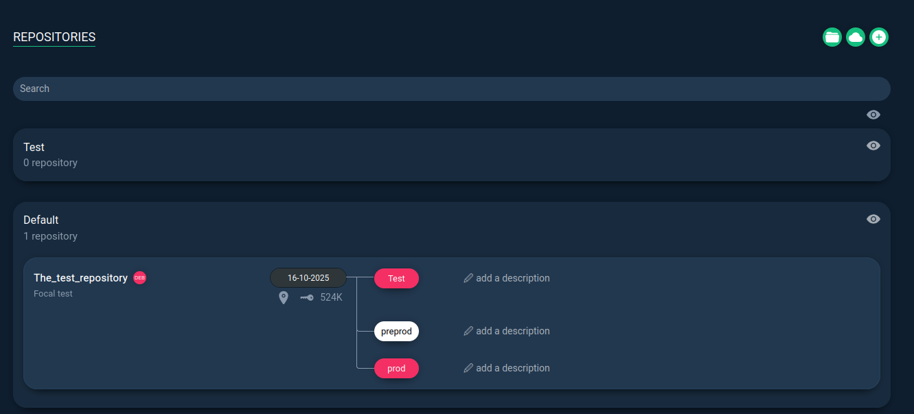
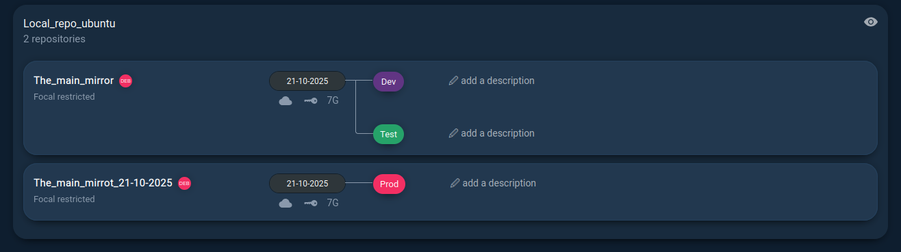
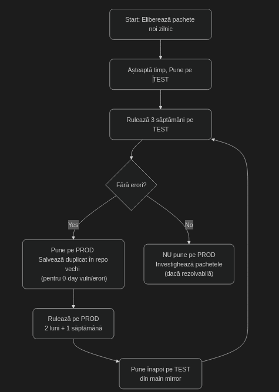

# [RepoManager](https://github.com/lbr38/repomanager?tab=readme-ov-file)
Instrument: UI modern pentru gestionarea repository‑urilor DEB (mirroring, snapshoturi, medii Dev/Test/Prod, publicare pentru APT).

## Cerințe de sistem pentru RepoManager
| Tip                   | Componentă                    | Cerință minimă / recomandată                                   |
|------------------------|-------------------------------|----------------------------------------------------------------|
| **CPU**                | Procesor                      | 4 vCPU                                                         |
| **RAM**                | Memorie                       | 4 GB RAM (recomandat 8 GB+ pentru producție)                   |
| **Sistem de operare**  | OS                            | Orice sistem compatibil cu Docker |
| **Containerizare**     | Docker                        | Necesită instalare și rulare Docker                            |
| **Performanță**        | Stocare / IO                  | SSD recomandat pentru latență scăzută                          |


## RepoManage functional:
| **Acțiune**              | **Scop**                                                 | **Exemplu comun**                                              |
| ------------------------ | -------------------------------------------------------- | -------------------------------------------------------------- |
| **Update**               | Actualizează repo-ul din sursa originală (mirror)        | Sincronizezi cu `archive.ubuntu.com`                           |
| **Duplicate**            | Creează o copie separată pentru test sau modificări      | Clonezi `prod` → `test`                                        |
| **Point an environment** | Asociază un snapshot cu un mediu (prod/test/dev)         | Setezi snapshotul `v1.0` ca activ pentru `prod`                |
| **Rebuild**              | Reface indexurile și metadatele (Packages, Release)      | Ai șters/adăugat manual `.deb` și vrei să regenerezi fișierele |
| **Edit**                 | Modifică detaliile repo-ului (nume, descriere, etichete) | Schimbi numele „Focal test” în „Ubuntu 20.04 test”             |
| **Install**              | Publică snapshotul pentru instalare prin APT             | Faci repo-ul accesibil la `http://repo.local/ubuntu`           |
| **Delete**               | Șterge snapshotul sau repo-ul selectat                   | Elimini snapshoturile vechi pentru a elibera spațiu            |


## Instalare rapidă (Docker Compose)
Configurația standard folosește o imagine publică și definește volume persistente pentru a stoca datele aplicației și pachetele repo.
```yml
version: "3.8"

services:
  repomanager:
    image: lbr38/repomanager:latest
    container_name: repomanager
    restart: unless-stopped
    environment:
      - FQDN=repomanager.local      # pune FQDN-ul tău sau IP-ul
      - MAX_UPLOAD_SIZE=64M         # opțional (upload .deb/.rpm mari)
      # - NGINX_LISTEN_PORT=8080    # folosit DOAR cu network_mode: host
    ports:
      - "8080:8080"                 # UI + endpointuri repo
    volumes:
      - /etc/localtime:/etc/localtime:ro
      - repomanager-data:/var/lib/repomanager  # DB + loguri
      - repomanager-repo:/home/repo            # pachete/mirror-uri

volumes:
  repomanager-data:
  repomanager-repo:
```
### Pași de Rulare
Salvam configurația de mai sus într-un fișier numit docker-compose.yml.
```bash
sudo docker-compose up -d 
sudo docker-compose logs -f repomanager
```
### Acces la Interfața Web (UI)
Acces UI: http://\<IP\>:8080 sau http://repomanager.local:8080

Rulam si intram pe interfata Web:
 

Dupa ce am facut sync la toate pachetele avem urmatoare logica.
Flux logic de actualizare și promovare:
Update zilnic: Mirror-ul principal (main mirror) se actualizează zilnic cu ultimele pachete din sursa upstream (ex: archive.ubuntu.com).

Testare: După fiecare update, noile pachete sunt publicate automat în mediul Test, unde se efectuează testarea pe serverele de test.

Perioadă de validare: Se menține o perioadă de observație de aproximativ 3 săptămâni. Dacă în acest interval nu apar erori, conflicte sau vulnerabilități, snapshotul curent este promovat în Prod.

Promovare în Prod: După validare, același snapshot testat este setat ca activ pentru mediul de producție (Prod), fără a reface update-ul.

Politică de retenție: Snapshoturile utile (Test/Prod) se păstrează pentru o perioadă de minimum 3 luni. Această arhivare permite rollback rapid în caz de probleme.

Rollback și protecție
Dacă după promovare este descoperită o problemă majoră (ex: vulnerabilitate 0‑day, bug critic sau testare insuficientă), administratorul poate reveni rapid la o versiune anterioară:
Se reatribuie mediul Prod la snapshotul anterior (folosind funcția Point environment → Prod).

Astfel:

    Mediul Prod revine instant la pachetele stabile testate anterior;
    Nu este nevoie de reinstalări manuale;
    Versiunile rămân complet controlabile și trasabile.


## Verificare funcționare repository:
Dupa ce am adaugat repoul acum avem si pachetele locale `apt update`:
```bash
root@ubuntu2004:/home/ubuntu# apt list -a acl 
Listing... Done
acl/focal,now 2.2.53-6 amd64 [installed]
```

# In 2 cuvinte:
În fiecare zi mirrorul principal se actualizează → pachetele merg în Test → după 3 săptămâni fără erori sunt promovate în Prod → snapshoturile sunt păstrate 3 luni → dacă apare o problemă, se revine rapid la snapshotul anterior.
