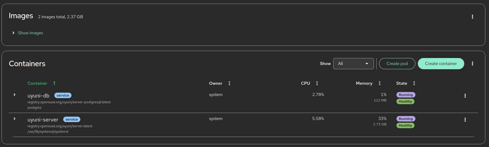

## System requirements:
| Software and Hardware | Recommendation |
|-----------|----------|
| openSUSE Leap Micro 6.1 | openSUSE Leap Micro 6.1 |
| CPU | Minimum 4 dedicated 64-bit CPU cares (x86-64) |
| RAM | Test or Base INstallation -> Minimum 16 GB |
| - | Production Server -> Minimum 32 GB| 
| Disk Space | 90 GB|
| Swap space | 3GB |

## Resume:
Instalare completă Uyuni Server (Containerized) pe openSUSE Leap Micro 6.2
cu podman, mgradm, mgrctl, și repository local creat ulterior.

## 1. Instalează pachetele de bază
Pe Leap Micro nu ai zypper clasic complet, deci se folosesc transactional updates:
```
# Deschide o sesiune transactională
sudo transactional-update shell
# Adaugă repository-ul Uyuni Master pentru Container Utils

zypper ar -f https://download.opensuse.org/repositories/systemsmanagement:/Uyuni:/Master:/ContainerUtils/openSUSE_Leap_Micro_6.2/systemsmanagement:Uyuni:Master:ContainerUtils.repo uyuni-master-containerutils

# Actualizează lista
zypper ref

# Instalează utilitarele Uyuni și container tools
zypper in -y podman uyuni-tools mgradm mgrctl mgradm-bash-completion mgrctl-bash-completion netavark

# Ieși din shell-ul transactional
exit

# Aplică schimbările și repornește sistemul
sudo reboot

```

## 2 Configurare hostname și hosts

Uyuni necesită un hostname static (FQDN):
```
sudo hostnamectl set-hostname uyuni.local
echo "172.16.49.135 uyuni.local uyuni" | sudo tee -a /etc/hosts
```

## 3 Instalează Uyuni Server (containerizat)

După reboot, rulează:
```
sudo mgradm install podman
```
### Acest pas:
- Descarcă containerele Uyuni (PostgreSQL, Tomcat, Taskomatic, Salt-master etc.)
- Le configurează automat
- Pornește serviciile Uyuni

Verifică dacă rulează:
```
sudo podman ps
```
Ar trebui să vezi containere uyuni-server, uyuni-database, etc.


Verificam logurile:
```
sudo systemctl status uyuni-server.service
sudo journalctl -u uyuni-server -n 200
```

