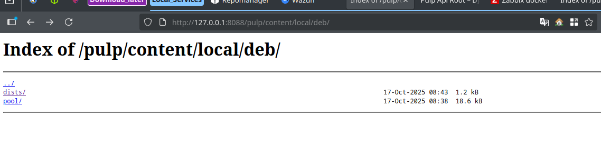

La fel o sa fie instalat din docker compose:
```yml 
services:
  pulp:
    image: pulp/pulp:stable
    container_name: pulp
    ports:
      - "8088:80"        # API Pulp accesibil la http://localhost:8088
    volumes:
      - ./settings:/etc/pulp
      - ./pulp_storage:/var/lib/pulp
      - ./pgsql:/var/lib/pgsql
      - ./containers:/var/lib/containers
    environment:
      PULP_WORKERS: "4"
      PULP_API_WORKERS: "2"
      PULP_CONTENT_WORKERS: "2"
    restart: unless-stopped

  pulp-ui:
    image: node:22-bullseye
    container_name: pulp-ui
    working_dir: /app
    # instalăm git, marcăm /app ca safe, apoi pornim UI-ul
    command: bash -lc "apt-get update && apt-get install -y git && git config --global --add safe.directory /app && npm install && npm run start"
    ports:
      - "3333:8002"            # UI: http://localhost:3333
    volumes:
      - ./pulp-ui:/app         # ai deja repo-ul pulp-ui clonat aici
    environment:
      - CI=true
    depends_on:
      - pulp
```

Instalam CLI:
```bash
python3 -m pip install --user pulp-cli pulp-cli-deb
```

Aici `172.22.0.2` este containerul cu `pulp` instalat:
```bash
~/.local/bin/pulp config create \
  --base-url http://172.22.0.2 \
  --username admin \
  --password 'password'
```

Creem un repozitoriu:
```bash
pulp deb repository create --name local-deb
```

Incarcam pachetele in repozitoriu nostru:
```bash
pulp deb repository upload --repository local-deb --file cowsay_3.03+dfsg2-8_all.deb 
```
Una dintre aceste trebuie sa lucreze:
```bash
pulp artifact upload --file /tmp/debs/cowsay_3.03+dfsg2-8_all.deb
```

```bash
curl -u admin:'PAROLA_TA' -H "Content-Type: application/json" \
  -d '{
        "artifact": "/pulp/api/v3/artifacts/0199f144-14e1-7bae-8b1c-302825d256c6/",
        "filename": "cowsay_3.03+dfsg2-8_all.deb"
      }' \
  http://localhost/pulp/api/v3/content/deb/packages/
```

```bash
curl -u admin:'password' -H "Content-Type: application/json" \
  -d '{
        "repository": "/pulp/api/v3/repositories/deb/apt/0199f139-8f5d-7915-bb01-e80cb29ae9b9/",
        "simple": true
      }' \
  http://localhost/pulp/api/v3/publications/deb/apt/
{"task":"/pulp/api/v3/tasks/0199f156-98af-7861-8d5d-c79c4a34aee6/"}
```


```bash
curl -u admin:'password' -H "Content-Type: application/json" \
  -d "{
        \"name\": \"local-deb-distro\",
        \"base_path\": \"local/deb\",
        \"publication\": \"/pulp/api/v3/publications/deb/apt/0199f1c2-.../\"
      }" \
  http://localhost/pulp/api/v3/distributions/deb/apt/
```

```bash
/pulp/api/v3/publications/deb/apt/0199f156-9903-79a6-a544-fff55c9bbfd2/
```

Verificare rapida:
```bash
curl -I http://127.0.0.1:8088/pulp/content/local/deb/
```

Dupa 7 mii de incercari avem si repozitoriul nostru 


```bash
    "distributions/deb/apt": "http://127.0.0.1:8088/pulp/api/v3/distributions/deb/apt/",
    "publications/deb/apt": "http://127.0.0.1:8088/pulp/api/v3/publications/deb/apt/",
    "remotes/deb/apt": "http://127.0.0.1:8088/pulp/api/v3/remotes/deb/apt/",
    "repositories/deb/apt": "http://127.0.0.1:8088/pulp/api/v3/repositories/deb/apt/",
    "content/deb/generic_contents": "http://127.0.0.1:8088/pulp/api/v3/content/deb/generic_contents/",
    "content/deb/installer_file_indices": "http://127.0.0.1:8088/pulp/api/v3/content/deb/installer_file_indices/",
    "content/deb/installer_packages": "http://127.0.0.1:8088/pulp/api/v3/content/deb/installer_packages/",
    "content/deb/package_indices": "http://127.0.0.1:8088/pulp/api/v3/content/deb/package_indices/",
    "content/deb/package_release_components": "http://127.0.0.1:8088/pulp/api/v3/content/deb/package_release_components/",
    "content/deb/packages": "http://127.0.0.1:8088/pulp/api/v3/content/deb/packages/",
    "content/deb/release_architectures": "http://127.0.0.1:8088/pulp/api/v3/content/deb/release_architectures/",
    "content/deb/release_components": "http://127.0.0.1:8088/pulp/api/v3/content/deb/release_components/",
    "content/deb/release_files": "http://127.0.0.1:8088/pulp/api/v3/content/deb/release_files/",
    "content/deb/releases": "http://127.0.0.1:8088/pulp/api/v3/content/deb/releases/",
    "content/deb/source_indices": "http://127.0.0.1:8088/pulp/api/v3/content/deb/source_indices/",
    "content/deb/source_release_components": "http://127.0.0.1:8088/pulp/api/v3/content/deb/source_release_components/",
    "content/deb/source_packages": "http://127.0.0.1:8088/pulp/api/v3/content/deb/source_packages/",
    "publications/deb/verbatim": "http://127.0.0.1:8088/pulp/api/v3/publications/deb/verbatim/",
```


```
curl -u admin:'password' -sS -X POST \
  -F "file=@/tmp/debs/sl_5.02-1_amd64.deb" \
  -F "repository=$REPO" \
  -F "distribution=stable" \
  -F "component=main" \
  "http://localhost/pulp/api/v3/content/deb/packages/"
{"task":"/pulp/api/v3/tasks/0199f22f-34af-716b-984b-8b0831fa6ab2/"}[root@8831ff65014d debs]# 
```

```bash
BASE="http://localhost"
REPO="/pulp/api/v3/repositories/deb/apt/0199f22a-c7bc-7596-a2cd-fc632a38ccba/"   # pune href-ul tău
TASK="/pulp/api/v3/tasks/0199f22f-34af-716b-984b-8b0831fa6ab2/"
```

```bash
# vezi starea task-ului
curl -u admin:'fn4chi9P' -sS "$BASE$TASK" | jq '{state, created_resources, error}'

# când state = "completed", extrage resursele create (content + repository-version)
curl -u admin:'fn4chi9P' -sS "$BASE$TASK" | jq -r '.created_resources[]'
```

```bash
[root@8831ff65014d debs]# curl -u admin:'password' -sS -X POST \
  -F "file=@/tmp/debs/sl_5.02-1_amd64.deb" \
  -F "repository=${BASE}${REPO}" \
  -F "distribution=stable" \
  -F "component=main" \
  "${BASE}/pulp/api/v3/content/deb/packages/"
{"task":"/pulp/api/v3/tasks/0199f233-d574-7d7a-b9c8-4a9751e61b67/"}

```

## Snapsoturi:
#TODO
## Inghetarea repo:
#TODO
## Stable vs Testing
#todo
## Probleme depistate:
Principala problema la moment depistata este ca interfata grafica nu este disponibela pentru `.deb` 
Incomoditatea dea lucru doar din consola + un stack plin de tehnologi
