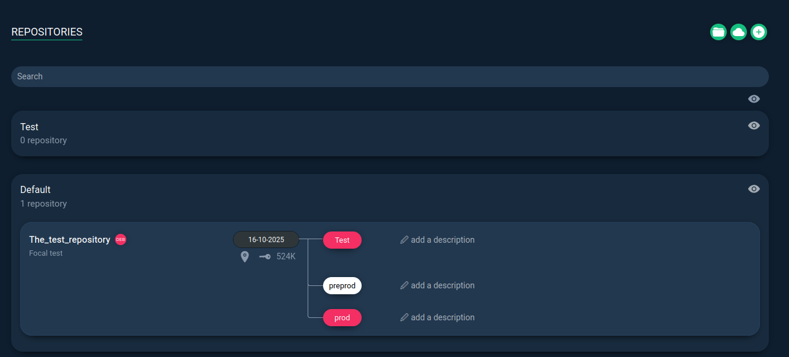

Sunt instalate din `docker compose`:
```yml
version: "3.8"

services:
  repomanager:
    image: lbr38/repomanager:latest
    container_name: repomanager
    restart: unless-stopped
    environment:
      - FQDN=repomanager.local      # pune FQDN-ul tău sau IP-ul
      - MAX_UPLOAD_SIZE=64M         # opțional (upload .deb/.rpm mari)
      # - NGINX_LISTEN_PORT=8080    # folosit DOAR cu network_mode: host
    ports:
      - "8080:8080"                 # UI + endpointuri repo
    volumes:
      - /etc/localtime:/etc/localtime:ro
      - repomanager-data:/var/lib/repomanager  # DB + loguri
      - repomanager-repo:/home/repo            # pachete/mirror-uri

volumes:
  repomanager-data:
  repomanager-repo:
```
Rulam si intram pe interfata Web:

Avem repositories care sunt adaugate 2 tipuri `Mirror/Local` 