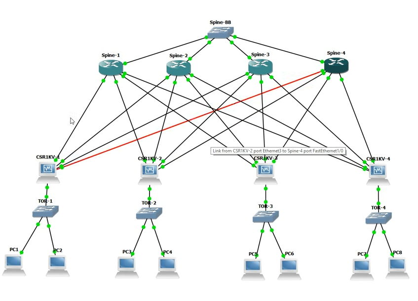
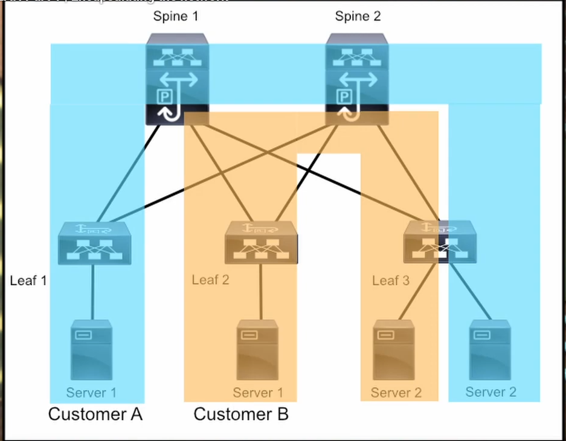
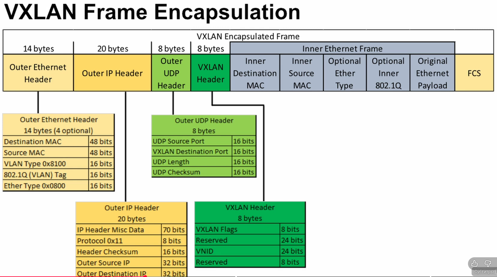
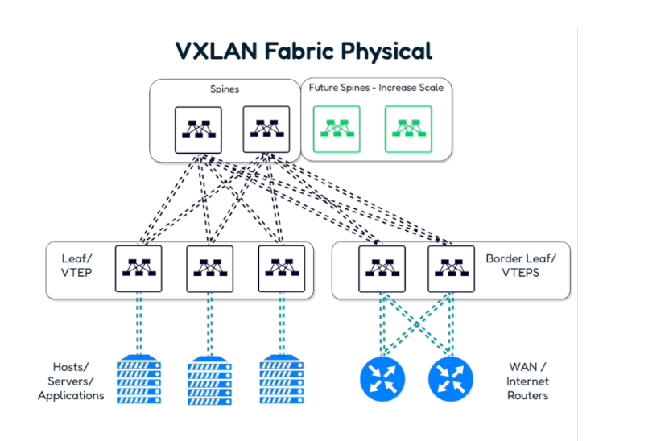

VxLAN schema:








https://www.youtube.com/watch?v=80RFILipeng
**Leaf** - Rulează VXLAN Tunnel Endpoints (VTEP) încapsulează și decapsulează traficul VXLAN. Conectează servere, hypervisoare, echipamente de securitate etc.Rulează VXLAN Tunnel Endpoints (VTEP) → încapsulează și decapsulează traficul VXLAN.Pot rula EVPN (Ethernet VPN) pentru control plane, care anunță ce MAC/IP apar în fiecare Leaf.Se ocupă de gateway L3 (routing între segmente VXLAN).

🔹 Exemplu:
Dacă ai un server în VLAN 10 conectat la Leaf1 și altul în VLAN 10 pe Leaf2, traficul dintre ele merge peste VXLAN tunnel.

**Spine** - 

**VXLAN** (Virtual eXtensible LAN) -  VxLan supports 16,000,000 Layer 2 sergments
VXLAN tunnel
VTEP Tunnel - ???

GRE - ???

EVPN - ???

MP-BGP - ???

Deploying VXLAN with MP-BGP EVPN

    Configure L3 links
    Configure Link-state routing protocol on underlay network (OSPF or IS-IS)
    Configure BGP and set up route reflectors on non-VTEP switches
    Configure Multicast routing (PIM Sparse-mode)
    Enable VXLAN on the switches
    Map VLANs to VXLAN VNIs
    Create Network Virtualization Endpoint (NVE) interfaces for the VNIs
    Configure EVPN on BGP
    Attach devices and set them to the correct VLANs/VNIs


### VXLAN:
 ```Cisco
 feature tunnel
 interface tunnel 0
 tunnel source loopback0
 tunnel destination 10.111.111.91
 ip address 172.16.12.1/24
 ```

Verificam ce functional putem activa:
```
show feature | inc <bgp sau ospf>
```

Enable **bgp** on router:
```
router bgp 65005
```