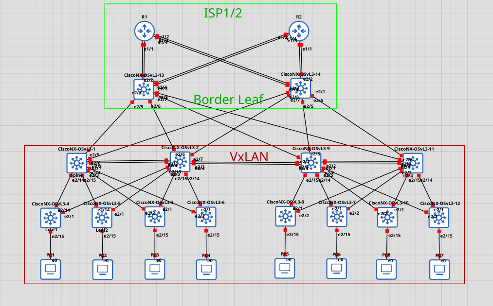

# VxLAN:
**VXLAN** (Virtual eXtensible LAN) -  VXLAN este tunel L2 peste rețea L3. Frame-ul pe care îl vezi este practic un „frame Ethernet original” învelit într-un header de transport (Ethernet → IP → UDP → VXLAN) — ca să poată traversa rețeaua IP între VTEP-uri. VxLan supports 16,000,000 Layer 2 sergments 

## Terminologie:
VXLAN tunnel – Tunel care transportă un cadru Ethernet (Layer 2) peste o rețea IP (Layer 3), permițând extinderea unui VLAN între switch-uri aflate în rețele diferite.

VTEP (VXLAN Tunnel Endpoint) – Dispozitivul (de obicei un switch Leaf) care împachetează traficul în VXLAN și îl despachetează la destinație.

GRE (Generic Routing Encapsulation) – Un tip simplu de tunel care transportă pachete IP peste alte rețele IP, dar fără segmentare VLAN și fără control-plane (spre deosebire de VXLAN).

EVPN (Ethernet VPN) – Un mecanism de control-plane care spune switch-urilor unde se află MAC-urile și IP-urile, evitând broadcast-ul și învățarea prin flood.

MP-BGP (Multiprotocol BGP) – Protocolul folosit pentru a transporta informațiile EVPN între Leaf-uri, adică „poștașul” care distribuie actualizările MAC/IP în fabric.

## Schema:


1) Outer Ethernet header — 14 bytes (poate +4 dacă există VLAN tag)

        Destination MAC (6 bytes) — MAC-ul VTEP-ului destinație (nu MAC final al hostului)
        Source MAC (6 bytes) — MAC-ul VTEP source
        Ethertype (2 bytes) — de obicei 0x0800 pentru IPv4 (sau 0x86DD pentru IPv6)
        Opțional: înainte de Ethertype poți avea un 802.1Q VLAN tag (4 bytes) — atunci header devine 18 bytes (sau 22 cu două taguri).

2) Outer IP header — 20 bytes (IPv4, fără opţiuni)

        Version / IHL / TOS / Length / ID / Flags+Fragment / TTL / Protocol / Header checksum
        Important: Protocol = 17 (UDP)
        Source IP (4 bytes) — IP VTEP sursă
        Destination IP (4 bytes) — IP VTEP destinație
        (IPv6 ar folosi 40 bytes pentru headerul IP.)

3) Outer UDP header — 8 bytes

        UDP Source Port (2 bytes) — de obicei un port efemer calculat din hash (flux hash) — folosit pentru ECMP în rețea (multe VTEP-uri => balansare pe flux).
        UDP Destination Port (2 bytes) — implicit 4789 (IANA VXLAN) — poate fi şi alt port dacă implementarea îl schimbă.
        UDP Length (2 bytes)
        UDP Checksum (2 bytes) — în IPv4 poate fi 0 (opţional), în IPv6 obligatoriu.

4) VXLAN Header — 8 bytes

        Structura (din stânga spre dreapta):
        Flags (8 bits) — bitul V (valid) = 1 indică că VNID este valid; restul sunt rezervate.
        Reserved (24 bits) — rezervat pentru viitor.
        VNID (24 bits) — VXLAN Network Identifier — identifică „L2 segmentul” virtual (poți avea ~16.7M VNID-uri: 0..16777215).
        Reserved (8 bits) — umplutură / aliniere.
        Deci VNID = 3 bytes în interiorul acestor 8 bytes.

5) Inner Ethernet frame — partea originală (ce vrem să transmită)

        Inner Destination MAC (6 bytes) — MAC real al gazdei finale
        Inner Source MAC (6 bytes) — MAC al gazdei sursă
        Optional inner 802.1Q tag (4 bytes) — dacă frame-ul original avea VLAN
        EtherType (2 bytes) — ex. 0x0800 pentru IPv4, 0x86DD pentru IPv6, etc.
        Payload — frame payload (IP packet, ARP, etc.)
        FCS (4 bytes) — Frame Check Sequence (de obicei adăugat de NIC la egress)


**Leaf** - Rulează VXLAN Tunnel Endpoints (VTEP) încapsulează și decapsulează traficul VXLAN. Conectează servere, hypervisoare, echipamente de securitate etc.Rulează VXLAN Tunnel Endpoints (VTEP) → încapsulează și decapsulează traficul VXLAN.Pot rula EVPN (Ethernet VPN) pentru control plane, care anunță ce MAC/IP apar în fiecare Leaf.Se ocupă de gateway L3 (routing între segmente VXLAN).

🔹 Exemplu:
Dacă ai un server în VLAN 10 conectat la Leaf1 și altul în VLAN 10 pe Leaf2, traficul dintre ele merge peste VXLAN tunnel.

**Spine** - Sunt switch-urile din stratul central al fabric-ului.

🔹 Exemplu:

Leaf1 ↔ Spine1/Spine2 ↔ Leaf2
Spine-le nu trebuie să știe VLAN-uri → doar rutează IP-urile care transportă encapsularea VXLAN.


### Rezumat vizual:
```bash
          +------------+
          |   Spine1   |
          +------------+
           /    |     \
          /     |      \
+---------+  +---------+  +---------+
|  Leaf1  |  |  Leaf2  |  |  Leaf3  |
+---------+  +---------+  +---------+
    |             |             |
   VM/Server     VM/Server     VM/Server

Leaf: termină VXLAN (VTEP) + gateway + EVPN.
Spine: doar rutare L3 + ECMP (nu termină VXLAN).
```
### Implementarea:
Deploying VXLAN with MP-BGP EVPN
1. Configurează legăturile Layer 3 între switch-uri.
2. Configurează protocolul de rutare de tip link-state în rețeaua underlay (OSPF sau IS-IS).
3. Configurează BGP și stabilește route reflectors pe switch-urile care nu sunt VTEP-uri (de obicei Spine-urile).
4. Configurează rutarea multicast (PIM Sparse-Mode) dacă folosești VXLAN în modul flood & learn (fără EVPN).
5. Activează VXLAN pe switch-uri.
6. Asociază VLAN-urile cu identificatori VXLAN (VNI).
7. Creează interfețele de virtualizare NVE (Network Virtualization Endpoint) pentru fiecare VNI.
8. Configurează EVPN peste BGP pentru distribuirea MAC/IP în fabric.
9. Conectează echipamentele finale și atribuie-le VLAN-urile / VNI-urile corespunzătoare.s


### Implementarea in GNS3:
#TODO schema + configuratie la dispozitive

Problema intampinata pe switcheurile date nu pot seta configura OSPF, BGP deci trebuie de gasit alt ceva :(
 ```cisco
 feature tunnel
 interface tunnel 0
 tunnel source loopback0
 tunnel destination 10.111.111.91
 ip address 172.16.12.1/24
 ```

Verificam ce functional putem activa:
```cisco
show feature | inc <bgp sau ospf>
```

Enable **bgp** on router:
```cisco
router bgp 65005
```

#### [Guide youtube](https://www.youtube.com/watch?v=80RFILipeng):
