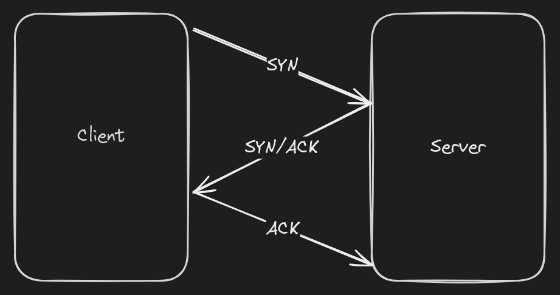
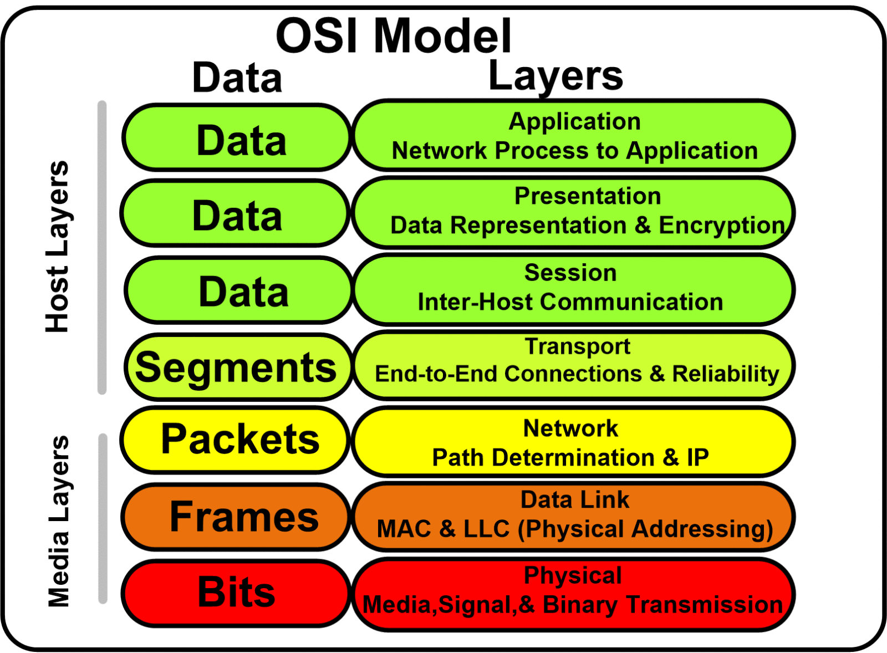
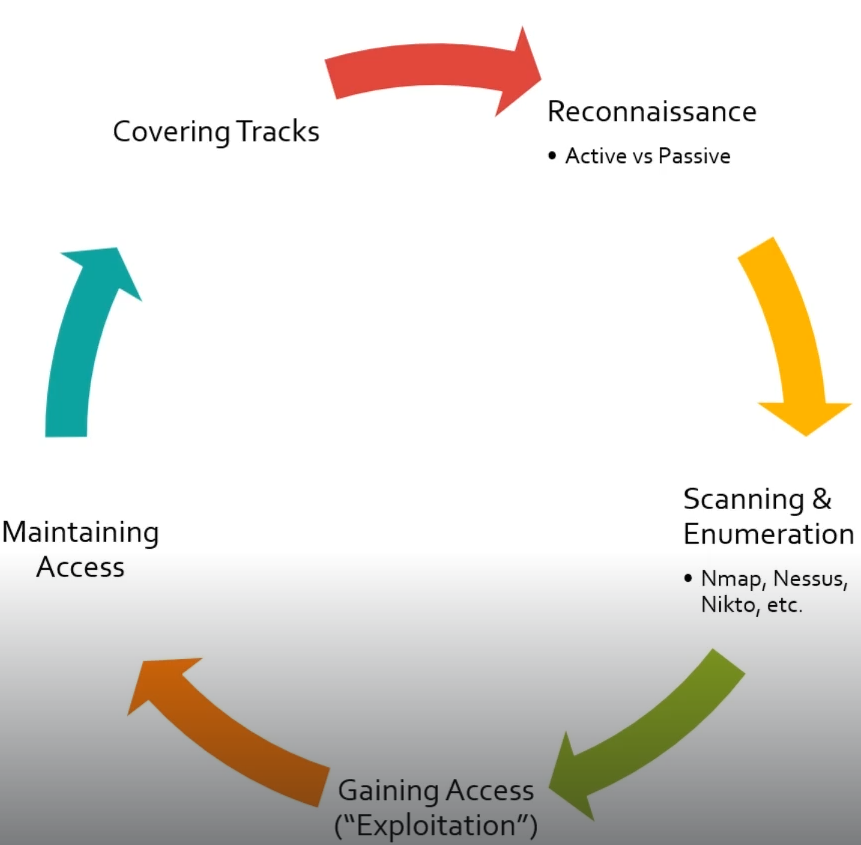

# PJPT 
24 ore lab + 2-3 zile raport

## Coursuri recomandate:
1. Practical Ethical Hacking - The complete Course
2. Open-Source Intelligence (OSINT) Fundamentals
3. External Pentest Playbook
4. Windows Privilege Escalation for Beginners
5. Linux Privilege Escalation fot Beginners

## Notekeeping:
- Notion 
- Obsidian 
- Joplin
- GitBook
- CheryTree
- OneNote

### Screenshots Windows:
- GreenShot 
- FlameShot

## Networking Refresher:
- IP addresses
- MAC Addresses 
- TCP, UDP and Three-Way Handshake
- Common Ports and Protocols
- The OSI Model
- Subnetting
---
**IP addresses** - un IP address este identificatorul numeric al unui dispozitiv în rețea (ex.: 192.168.1.10 pentru IPv4). IPv4 = 4 octeți (ex. 203.0.113.5); IPv6 = șir hex (ex. 2001:db8::1).

**MAC Addresses** (Media Access Control Address) - dentificator unic atribuit unei plăci de rețea (NIC). 6 perechi hex (ex. 00:1A:2B:3C:4D:5E). permite identificarea dispozitivelor în rețele Ethernet / Wi-Fi în cadrul aceleiași rețele locale (LAN).

**NAT** - Este deja adresa fizică a dispozitivului sau a interfeții de rețea. Dupa primi 3 octeți putem vedea cine este vendorul pe acest [portal](https://maclookup.app/search/result?mac=00:15:5d).

**TCP, UDP** and **Three-Way Handshake** - (negocierea conexiunii TCP) reprezintă procesul prin care două dispozitive stabilesc o conexiune TCP, în care clientul trimite un mesaj SYN pentru a solicita conexiunea, serverul răspunde cu SYN-ACK pentru a confirma primirea și disponibilitatea, iar clientul trimite înapoi ACK pentru a finaliza stabilirea sesiunii, după care comunicarea poate începe; pe scurt, este mecanismul de inițializare a unei conexiuni fiabile între două sisteme.

- **TCP**(Transmission Control Protocol) -  este un protocol orientat pe conexiune care asigură livrarea garantată și în ordinea corectă a pachetelor, folosind mecanisme de confirmare (ACK) și retransmisie, fiind mai lent dar sigur; este utilizat în protocoale precum HTTP/HTTPS, SSH, FTP, SMTP și Telnet și poate fi descris pe scurt ca un protocol fiabil, controlat și ordonat.
- **UDP**(User Datagram Protocol) - este un protocol fără conexiune care nu garantează livrarea sau ordinea pachetelor și nu folosește mecanisme de confirmare, fiind mult mai rapid, dar mai puțin sigur decât TCP; este utilizat în aplicații unde viteza este mai importantă decât acuratețea, precum DNS, VoIP, streaming audio-video și jocuri online, și poate fi descris pe scurt ca un protocol rapid, simplu și fără garanții.
##### Three-Way handshake

Three-Way Handshake este procesul folosit de TCP pentru a stabili o conexiune între două dispozitive. Este o secvență de trei pași care are loc înainte ca transmiterea datelor să poată începe. Iată cum funcționează:

- SYN (Synchronize): Dispozitivul inițiator (numit de obicei client) trimite un pachet TCP cu flag-ul SYN activat către dispozitivul de destinație (numit server). Acest pachet indică intenția de a stabili o conexiune și conține un număr de secvență inițial.
- SYN-ACK (Synchronize-Acknowledge): După ce primește pachetul SYN, dispozitivul de destinație răspunde cu un pachet TCP ce are flag-urile SYN și ACK activate. Acest pachet confirmă primirea cererii și include propriul număr de secvență inițial.
- ACK (Acknowledge): În final, dispozitivul inițiator confirmă pachetul SYN-ACK trimițând înapoi un pachet ACK către destinație. Acest pachet confirmă stabilirea conexiunii și conține, de obicei, numărul de secvență incrementat.

```wireshark filtre
tcp.flags.syn == 1 or tcp.flags.ack == 1
```
#TODO

### Common Ports and Protocols:
| Protocol / Serviciu | Descriere | Port | Tip Transport |
|--------------------|-----------|------|----------------|
| FTP | File Transfer Protocol | 21 | TCP |
| SSH | Secure Shell | 22 | TCP |
| Telnet | Remote Terminal Access | 23 | TCP |
| SMTP | Simple Mail Transfer Protocol | 25 | TCP |
| DNS | Domain Name System | 53 | TCP / UDP |
| HTTP | Hypertext Transfer Protocol | 80 | TCP |
| HTTPS | Hypertext Transfer Protocol Secure | 443 | TCP |
| DHCP | Dynamic Host Configuration Protocol | 67 (Server), 68 (Client) | UDP |
| POP3 | Post Office Protocol v3 | 110 | TCP |
| IMAP | Internet Message Access Protocol | 143 | TCP |
| SNMP | Simple Network Management Protocol | 161 | UDP |
| NTP | Network Time Protocol | 123 | UDP |
| SMB | Server Message Block | 445 | TCP |
| TFTP | Trivial File Transfer Protocol | 69 | UDP |
| FTPS | FTP Secure (SSL/TLS) | 990 | TCP |
| LDAP | Lightweight Directory Access Protocol | 389 | TCP / UDP |
| MySQL | MySQL Database Service | 3306 | TCP |
| RDP | Remote Desktop Protocol | 3389 | TCP |
#TODO referinta la fiecare protocol scanarea lui si comenzi din linux 


### OSI Model:
Modelul OSI (Open Systems Interconnection)

Modelul OSI este un cadru conceptual care împarte procesul de comunicație în rețea în 7 straturi. Fiecare strat are responsabilități specifice și comunică cu straturile de deasupra și dedesubt. Scopul său este să standardizeze modul în care dispozitivele comunică între ele și să faciliteze proiectarea, înțelegerea și depanarea rețelelor.
| Nr.   | Strat                              | Rol principal                                                                                | Exemple                               |
| ----- | ---------------------------------- | -------------------------------------------------------------------------------------------- | ------------------------------------- |
| **1** | **Physical** *(Fizic)*             | Transmiterea bitilor brut pe mediu (cupru, fibră, radio)                                     | cabluri, semnale, conectori           |
| **2** | **Data Link** *(Legătură de date)* | Asigură transmiterea cadrelor între dispozitive din aceeași rețea locală și detectează erori | **MAC**, **Ethernet**, **Wi-Fi**, PPP |
| **3** | **Network** *(Rețea)*              | Rutarea pachetelor între rețele diferite, adresare logică                                    | **IP**, ICMP, rutare                  |
| **4** | **Transport**                      | Asigură livrarea datelor între gazde finale, control du-te/vino                              | **TCP**, **UDP**                      |
| **5** | **Session** *(Sesiune)*            | Creează, menține și închide sesiunile dintre aplicații                                       | Control comunicare între aplicații    |
| **6** | **Presentation** *(Prezentare)*    | Transformă datele (criptare, compresie, encoding)                                            | SSL/TLS, formate date                 |
| **7** | **Application**                    | Interacțiunea directă cu utilizatorul și aplicațiile                                         | **HTTP**, **FTP**, **SMTP**, **DNS**  |

Metoda de memorizare:
**Please Do Not Throw Sausage Pizza Away** 

#### OSI Schema:


## Subnetting:
**Subnetting** - este procesul prin care o rețea IP mare este împărțită în rețele mai mici numite subrețele (subnets).
Scopul este folosirea mai eficientă a adreselor IP și o organizare mai bună a rețelei.

Subnetting se face prin împrumutarea unor biți din partea de host a adresei pentru a crea ID-uri de subnet.

Acesta este fisierul care ne ajuta [exel subnet](../src/docx/Subnet-Guide.xlsx) 

### Subnet x.0.0.0
| CIDR | /1 | /2 | /3 | /4 | /5 | /6 | /7 | /8 |
|------|----|----|----|----|----|----|----|----|
| **Hosts** | 2,147,483,648 | 1,073,741,824 | 536,870,912 | 268,435,456 | 134,217,728 | 67,108,864 | 33,554,432 | 16,777,216 |

---

### Subnet 255.x.0.0
| CIDR | /9 | /10 | /11 | /12 | /13 | /14 | /15 | /16 |
|------|----|-----|-----|-----|-----|-----|-----|-----|
| **Hosts** | 8,388,608 | 4,194,304 | 2,097,152 | 1,048,576 | 524,288 | 262,144 | 131,072 | 65,536 |

---

### Subnet 255.255.x.0
| CIDR | /17 | /18 | /19 | /20 | /21 | /22 | /23 | /24 |
|------|-----|-----|-----|-----|-----|-----|-----|-----|
| **Hosts** | 32,768 | 16,384 | 8,192 | 4,096 | 2,048 | 1,024 | 512 | 256 |

---

### Subnet 255.255.255.x
| CIDR | /25 | /26 | /27 | /28 | /29 | /30 | /31 | /32 |
|------|-----|-----|-----|-----|-----|-----|-----|-----|
| **Hosts** | 128 | 64 | 32 | 16 | 8 | 4 | 2 | 1 |

---

### Subnet Mask Byte Values (Replace x)
| Value | 128 | 192 | 224 | 240 | 248 | 252 | 254 | 255 |
|-------|-----|-----|-----|-----|-----|-----|-----|-----|

---

### Notes:
Număr Subneturi = 2^număr_biți_împrumutați

Host-uri pe subnet = 2^(biți_rămași) - 2
### Exemple:
| Subnet | Rețea            | Interval adrese utilizabile   | Broadcast     |
| ------ | ---------------- | ----------------------------- | ------------- |
| 1      | 192.168.0.0/26   | 192.168.0.1 – 192.168.0.62    | 192.168.0.63  |
| 2      | 192.168.0.64/26  | 192.168.0.65 – 192.168.0.126  | 192.168.0.127 |
| 3      | 192.168.0.128/26 | 192.168.0.129 – 192.168.0.190 | 192.168.0.191 |
| 4      | 192.168.0.192/26 | 192.168.0.193 – 192.168.0.254 | 192.168.0.255 |

## Subneting 2:
Mai multe exemple:
| CIDR            | Mască subnet    | Hosturi utilizabile | Network      | Broadcast     | Interval hosturi            |
| --------------- | --------------- | ------------------- | ------------ | ------------- | --------------------------- |
| 192.168.1.0/24  | 255.255.255.0   | 254                 | 192.168.1.0  | 192.168.1.255 | 192.168.1.1 – 192.168.1.254 |
| 192.168.1.0/28  | 255.255.255.240 | 14                  | 192.168.1.0  | 192.168.1.15  | 192.168.1.1 – 192.168.1.14  |
| 192.168.1.16/28 | 255.255.255.240 | 14                  | 192.168.1.16 | 192.168.1.31  | 192.168.1.17 – 192.168.1.30 |
| 192.168.0.0/23  | 255.255.254.0   | 510                 | 192.168.0.0  | 192.168.1.255 | 192.168.0.1 – 192.168.1.254 |
| 192.168.2.0/23  | 255.255.254.0   | 510                 | 192.168.2.0  | 192.168.3.255 | 192.168.2.1 – 192.168.3.254 |
| 192.168.0.0/22  | 255.255.252.0   | 1022                | 192.168.0.0  | 192.168.3.255 | 192.168.0.1 – 192.168.3.254 |
| 192.168.1.0/26  | 255.255.255.192 | 62                  | 192.168.1.0  | 192.168.1.63  | 192.168.1.1 – 192.168.1.62  |
| 192.168.1.0/27  | 255.255.255.224 | 30                  | 192.168.1.0  | 192.168.1.31  | 192.168.1.1 – 192.168.1.30  |

## Setting Up Our Lab:
Aici putem instala 2 produse de virtualizare VirtualBox/VMware. VMware deja este instalat si configuralt pe sistem de accea accesta o sa fie folosit pentru a ridica laboratoarele. 

## Linux:
#TODO https://academy.tcm-sec.com/p/linux-fundamentals

## Python:
#TODO https://academy.tcm-sec.com/p/programming-100-fundamentals

## The Five Stages of Ethical Hacking:
Etapele hacking-ului etic

1. Reconnaisance (Colectare informații)
Adună informații pasive despre țintă: site-uri publice, DNS, WHOIS, rețele sociale, arhive. Scop: înțelege infrastructura și identifică posibile puncte de intrare.

2. Scanning (Scanare)
Provoacă activ ținta pentru a descoperi porturi deschise, servicii și vulnerabilități (port-scan, mapping, vulnerability scan). Produce lista de vectori exploatabili.
 
3. Gaining Access (Obținerea accesului)
Folosește vulnerabilitățile găsite pentru a pătrunde (exploits, cracking parole, social engineering). Obiectiv: acces la sistem/conturi pentru a demonstra impactul.

4. Maintaining Access (Menținerea accesului)
Instalează mecanisme de persistență (backdoor, reverse shell, conturi ascunse) pentru a arăta ce ar putea face un atacator real dacă nu e descoperit.

5. Covering Tracks (Acoperirea urmelor)
Șterge sau modifică dovezile activității (loguri, fișiere temporare), restabilește sau ascunde schimbările pentru a evalua detectabilitatea și capacitatea de răspuns.

#TODO - Trebuie sal fac in obsidian diagrams sa arate mai bine 


## Information Gathering(Reconnaissance):
### Passive Reconnaissance Overview:
Web/Host:
Target Validation:
- whois
- nslookup
- dnsrecon
Finding Subdomains:
- Google Fu
- dig
- Nmap
- Sublist3r
- Bluto
- crt.sh
Fingerprinting:
- nmap 
- Wappalyzer
- BuiltWith
- Netcat
Data Breaches:
- HavelBeenPwned 
- BreachParse
- WeLeakInfo

### Identifying Our Target:
Bug Bounty:
- Bugcrowd

### Discovering Email Addresses:
Email OSINT:
- hunter.io
- phonebook.cz
- voilanorbert.com
- ClearbitConnect gmail service(need more information)
    - verify email addres https://tools.emailhippo.com/

###  Gathering Breached Credentials with Breach-Parse:
- Tool [breach-parse](https://github.com/hmaverickadams/breach-parse) wordlist-ul are aproape 50GB 

###  Hunting Breached Credentials with DeHashed:
- [DeHashed](https://dehashed.com/) contra plata
- [Hashes](https://hashes.com/en/decrypt/hash) permite sa intoducem un hash si sa vedem in clear text


### Hunting Subdomains Part 1
#### Sublist3r 
tool Python pentru enumera­rea subdomeniilor folosind mai multe surse publice (Google, Yahoo, Bing, PassiveDNS, etc.). Rapid pentru recon și ușor de folosit în linie de comand
```bash
# Install
apt install sublist3r
yay -S sublist3r
# Run 
sublist3r -d tesla.com 
```
#### [crt.sh](https://crt.sh/)
serviciu web (Certificate Transparency search) care caută certificate emise pentru un domeniu; foarte util pentru descoperirea subdomeniilor prin certificatele publicate.
```request
%.tesla.com
```
#### OWASP Amass:
framework avansat pentru enumerarea subdomeniilor și harta de rețea (passive + active + DNS bruteforce + scraping). Potrivit pentru cercetări exhaustive și generare de grafuri.
```bash
yay -S amass        # sau amass-bin dacă preferi binarul precompilat
amass -version
amass enum -d tesla.com
```

### Identifying Website Technologies:
- [BuiltWith](https://builtwith.com/) - serviciu web care detectează tehnologiile folosite de un site (CMS, analytics, biblioteci, hosting, CDN). Bun pentru profiling rapid al unei ținte web.
- Wappalyzer - extensie/bibliotecă care identifică tehnologii web (frameworks, librării, servere, CMS). Are plugin browser și CLI/ API — util pentru audit rapid din browser.
- whatweb (CLI) - scanner CLI care detectează servere, CMS-uri, plugin-uri și metadate din pagini web; mai „agresiv” și customizabil prin pluginuri, util pentru fingerprinting web

### Information Gathering with Burp Suite:
