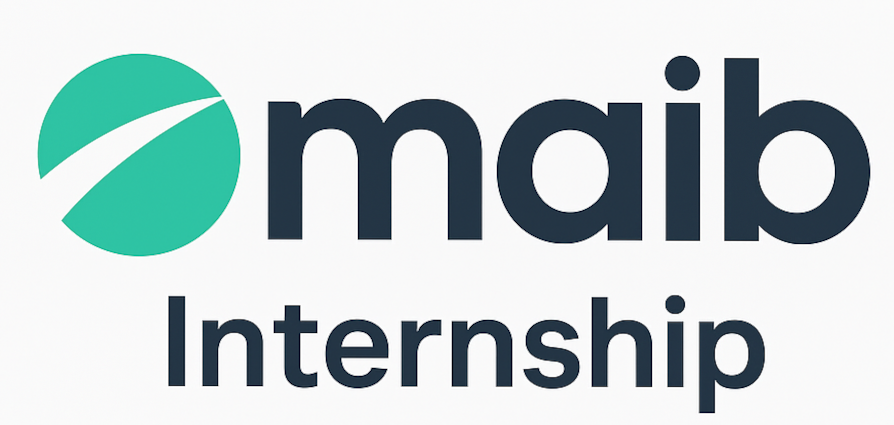

# 
🌐 MAIB Internship  

   

  <!-- Social / Platform badges -->
  
  
  

##  Module principale

###  Monitorizare
- [Zabbix Monitoring and Alerts](0.%20Zabbix-Monitoring-and-Alerts/README.md)

---

###  [Network Protocols Stack](2.%20Network-Design-and-Simulation/README.md)
Arhitectura rețelelor, rutare și protocoale fundamentale:  
- [Static Routing](1.%20Network-Protocols-Stack/0.StaticalRouting/README.md)
- [Spanning Tree Protocol (STP)](1.%20Network-Protocols-Stack/1.STP/README.md)
- [ACL & NAT](1.%20Network-Protocols-Stack/2.ACL_and_NAT/README.md)
- [Dynamic Routing (OSPF, RIP, BGP)](1.%20Network-Protocols-Stack/3.DynamicalRouting/README.md)
- [VPN](1.%20Network-Protocols-Stack/4.VPN/README.md)
- [Multicast](1.%20Network-Protocols-Stack/5.Multicast/README.md)
- [MPLS](1.%20Network-Protocols-Stack/6.MPLS/README.md)
- [EVPN Multihoming](1.%20Network-Protocols-Stack/7.EVPN_Multihoming/README.md)

---

###  [Network Design and Simulation](1.%20Network-Protocols-Stack/README.md)
- [Documentația și topologia rețelei](2.%20Network-Design-and-Simulation/README.md)
-  *Reteaua implementată (în lucru)*

---

### [Debian Repository Mirror Tools](3.%20Debian-Repository-Mirror-Tools/README.md)
Compararea și testarea soluțiilor pentru managementul local al pachetelor `.deb`  
- [Ghid principal](3.%20Debian-Repository-Mirror-Tools/README.md)
- **Install guides:**
  - [Aptly](3.%20Debian-Repository-Mirror-Tools/Install_guide/aplty/README.md)
  - [Foreman + Katello](3.%20Debian-Repository-Mirror-Tools/Install_guide/Foreman+Katello%20/README.md)
  - [Pulp3 + pulp_deb](3.%20Debian-Repository-Mirror-Tools/Install_guide/pulp3+pulp_deb/README.md)
  - [RepoManager](3.%20Debian-Repository-Mirror-Tools/Install_guide/RepoManager/README.md)
  - [Uyuni](3.%20Debian-Repository-Mirror-Tools/Install_guide/Uyuni/README.md)

---

##  Module personale
Proiecte individuale dezvoltate în cadrul internshipului:
- [SIEM Platform Wazuh](0.1.%20SIEM-Platform-Wazuh/README.md)
- [Secure VPN Server](0.2%20Secure-VPN-Server/README.md)
- [Honeypot T-Pot Deployment](0.3%20Honeypot-T-Pot-Deployment/README.md)

---

### 👨‍🏫 Mentori

<table border="0" style="border-collapse: collapse; border: none; text-align: center;">
  <tr>
    <!-- Alex Cushnir -->
    <td align="center" width="160">
      <a href="https://www.linkedin.com/in/alex-cushnir-457a8a33/">
        
         <b>Alex Cushnir</b> 💼 NOC Manager
      </a>
    </td>
    <!-- Mihail Cushnir -->
    <td align="center" width="160">
      <a href="https://www.linkedin.com/in/mihail-cushnir-27551296/">
        
         <b>Mihail Cushnir</b> 🐧 Linux System Administrator
      </a>
    </td>
    <!-- Dumitru Ene -->
    <td align="center" width="160">
      <a href="https://www.linkedin.com/in/dumitru-ene-0298b556/">
        
         <b>Dumitru Ene</b> 🌐 Network Administrator
      </a>
    </td>
    <!-- Alexandr Hasnaș -->
    <td align="center" width="160">
      <a href="https://www.linkedin.com/in/alexandr-hasnas-a921aaa9/">
        
         <b>Alexandr Hasnaș</b> 🌐 Network Administrator
      </a>
    </td>
    <!-- Mihail Batiri -->
    <td align="center" width="160">
      <a href="https://www.linkedin.com/in/mihail-batiri-57ba188b/">
        
         <b>Mihail Batiri</b> ⚙️ System Engineer
      </a>
    </td>
    <!-- Vladimir Petritchi -->
    <td align="center" width="160">
      <a href="https://www.linkedin.com/in/vladimir-petritchi/">
        
         <b>Vladimir Petritchi</b> 🪟 Windows System Administrator
      </a>
    </td>

  </tr>
</table>
